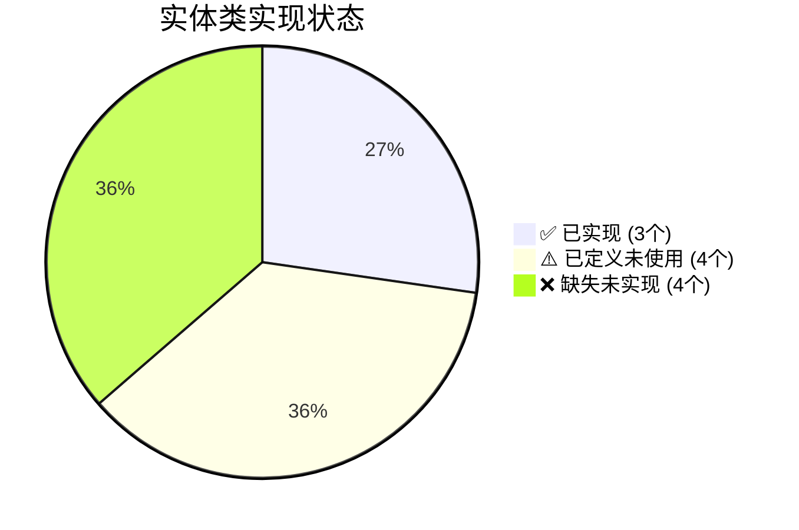
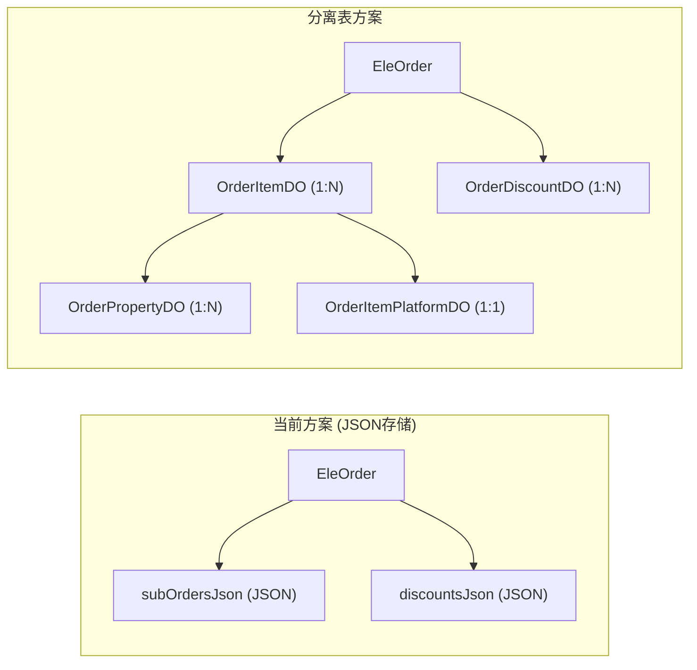
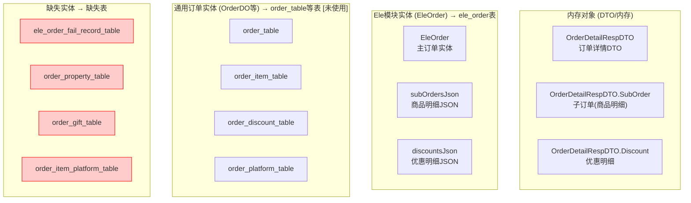
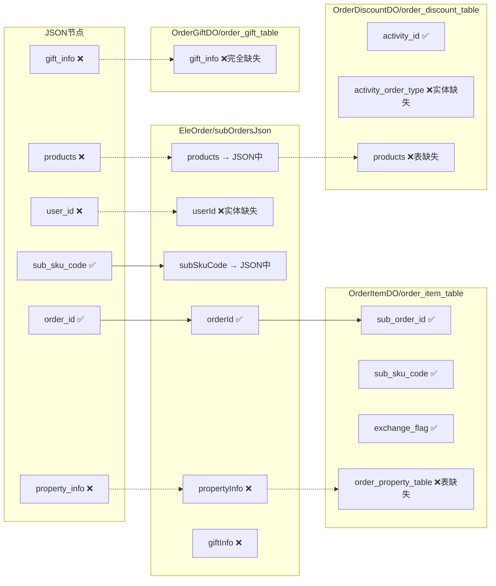

# 翱象订单数据结构映射文档

## 一、数据来源

### 1.1 JSON 原始数据 (list.json)

```json
{
  "body": {
    "errno": 0,
    "data": {
      "order_id": "5000037949712240215",           // 订单ID
      "channel_order_id": "2702081492751615274",   // 渠道订单号
      "user_id": "581417",                        // 用户ID(渠道)
      "store_code": "JC20251113",                 // 门店编码
      "erp_store_code": "185185",                 // ERP门店编码
      "channel_source_id": "35742115",            // 渠道来源ID
      "channel_source_name": "优团生活·精品超市（鄄城店）", // 渠道来源名称
      "channel_type": "MT",                        // 渠道类型
      "create_time": 1776224230000,               // 创建时间
      "pay_time": 1776224235000,                  // 支付时间
      "total_fee": 2400,                          // 订单总金额(分)
      "pay_fee": 1289,                            // 实付金额(分)
      "discount_fee": 1711,                       // 优惠金额(分)
      "delivery_fee": 329,                        // 配送费(分)
      "post_fee": 0,                              // 邮费(分)
      "package_fee": 100,                         // 包装费(分)
      "platform_commission_fee": 144,              // 平台佣金(分)
      "estimated_income": 1445,                   // 预估收入(分)
      "buyer_name": "姜先生",                      // 买家名称
      "buyer_phone": "19053115955,6623",          // 买家电话
      "buyer_address": "山东省菏泽市鄄城县...",    // 买家地址
      "delivery_name": "刘师傅",                   // 配送员名称
      "delivery_phone": "18605303777",            // 配送员电话
      "delivery_platform": 4,                     // 配送平台
      "delivery_type": 2,                         // 配送类型
      "delivery_status": 35,                     // 配送状态
      "latitude": "35.561376",                    // 纬度
      "longitude": "115.512247",                  // 经度
      "remark": "【如遇缺货】...",                 // 备注
      "expect_arrive_time": "2026-04-15 12:07:15~2026-04-15 12:07:15", // 期望送达时间
      "arrive_type": 2,                           // 送达方式
      "order_index": "36",                        // 订单序号
      "outbound_flag": 1,                         // 出库标志
      "status": 5,                                // 订单状态

      "sub_orders": [                             // 子订单列表(商品明细)
        {
          "sub_order_id": 5000037949696730215,    // 子订单ID
          "sku_code": "1790557752566530142",      // SKU编码
          "sku_name": "太姐辣白菜味辣条20g零食",   // 商品名称
          "barcode": "6977164310006",             // 条形码
          "specification": "20g/袋",              // 规格
          "price": 100,                           // 单价(分)
          "total_fee": 100,                       // 小计金额(分)
          "pay_fee": 100,                         // 实付金额(分)
          "buy_amount": 1,                        // 购买数量
          "weight": 20,                           // 重量(g)
          "goods_type": "0",                      // 商品类型
          "cabinet_code": "G-5-7-9、G-5-1-1",     // 柜子编码
          "exchange_flag": 0,                     // 是否换货
          "sub_sku_code": "1790557752566530142",  // 子SKU编码
          "property_info": [                     // 商品属性
            {
              "property_num": 1,
              "property_name": "20g/袋"
            }
          ],
          "combine_sku_list": [                   // 组合商品列表
            {
              "sku_code": "1698146937376968796",
              "sku_name": "农夫山泉 饮用天然水550ml/瓶",
              "barcode": "6921168509256",
              "price": 200,
              "num": 12,
              "weight": 550,
              "sub_sku_code": "1698146937376968796"
            }
          ]
        }
      ],

      "discounts": [                              // 优惠明细列表
        {
          "activity_id": "152010214245",          // 活动ID
          "activity_name": "购买可口可乐汽水...",  // 活动名称
          "type": "sku",                          // 优惠类型
          "discount_fee": 251,                    // 优惠金额(分)
          "platform_fee": 0,                      // 平台承担(分)
          "merchant_fee": 251,                    // 商户承担(分)
          "activity_order_type": 0,               // 活动订单类型
          "products": [                           // 优惠商品列表
            {
              "sub_order_id": 5000037949696740215,
              "sku_code": "1548982622263304247",
              "barcode": "6954767412573",
              "orig_price": 350,
              "discount_price": 251,
              "now_price": 99,
              "platform_fee": 0,
              "merchant_fee": 251
            }
          ]
        }
      ],

      "gift_info": []                             // 赠品信息
    }
  }
}
```

---

## 二、JSON 字段到实体类映射

### 2.1 订单主信息映射


| JSON 字段 | 类型 | 说明 | EleOrder (已实现) | OrderDO (未使用) | 备注 |
|-----------|------|------|-------------------|------------------|------|
| order_id | String | 订单ID | ✅ orderId | ✅ order_id | |
| channel_order_id | String | 渠道订单号 | ✅ channelOrderId | ✅ channel_order_id | |
| user_id | String | 用户ID(渠道) | ❌ 未映射 | ✅ user_id | **缺失** |
| store_code | String | 门店编码 | ✅ storeCode | ✅ store_code | |
| erp_store_code | String | ERP门店编码 | ✅ erpStoreCode | ❌ 未映射 | |
| channel_source_id | String | 渠道来源ID | ✅ channelSourceId | ✅ channel_source_id | |
| channel_source_name | String | 渠道来源名称 | ✅ channelSourceName | ✅ channel_source_name | |
| channel_type | String | 渠道类型 | ✅ channelType | ❌ 未映射 | |
| create_time | Long | 创建时间(毫秒) | ✅ createTime | ✅ create_time | |
| pay_time | Long | 支付时间(毫秒) | ✅ payTime | ✅ pay_time | |
| total_fee | Integer | 订单总金额(分) | ✅ totalFee | ✅ total_fee | |
| pay_fee | Integer | 实付金额(分) | ✅ payFee | ✅ pay_fee | |
| discount_fee | Integer | 优惠金额(分) | ✅ discountFee | ✅ discount_fee | |
| delivery_fee | Integer | 配送费(分) | ✅ deliveryFee | ✅ delivery_fee | |
| post_fee | Integer | 邮费(分) | ✅ postFee | ✅ post_fee | |
| package_fee | Integer | 包装费(分) | ✅ packageFee | ✅ package_fee | |
| platform_commission_fee | Integer | 平台佣金(分) | ✅ platformCommissionFee | ❌ 未映射 | |
| estimated_income | Integer | 预估收入(分) | ❌ 未映射 | ✅ estimated_income | **缺失** |
| buyer_name | String | 买家名称 | ✅ buyerName | ✅ buyer_name | |
| buyer_phone | String | 买家电话 | ✅ buyerPhone | ✅ buyer_phone | |
| buyer_address | String | 买家地址 | ✅ buyerAddress | ✅ buyer_address | |
| delivery_name | String | 配送员名称 | ✅ deliveryName | ✅ delivery_name | |
| delivery_phone | String | 配送员电话 | ✅ deliveryPhone | ✅ delivery_phone | |
| delivery_platform | Integer/String | 配送平台 | ✅ deliveryPlatform | ❌ 未映射 | |
| delivery_type | Integer | 配送类型 | ✅ deliveryType | ✅ delivery_type | |
| delivery_status | Integer | 配送状态 | ✅ deliveryStatus | ✅ delivery_status | |
| latitude | String | 纬度 | ✅ latitude | ✅ latitude | |
| longitude | String | 经度 | ✅ longitude | ✅ longitude | |
| remark | String | 备注 | ✅ remark | ✅ remark | |
| expect_arrive_time | String | 期望送达时间 | ❌ 未映射 | ✅ expect_arrive_time | **缺失** |
| arrive_type | Integer | 送达方式 | ❌ 未映射 | ✅ arrive_type | **缺失** |
| order_index | String/Integer | 订单序号 | ❌ 未映射 | ✅ order_index | **缺失** |
| outbound_flag | Integer | 出库标志 | ❌ 未映射 | ✅ outbound_flag | **缺失** |
| status | Integer | 订单状态 | ✅ status | ✅ order_status | |

---

### 2.2 子订单/商品明细映射 (sub_orders)

| JSON 字段 | 类型 | 说明 | OrderItemDO | SaasOrderGetResult.SubOrder | 备注 |
|-----------|------|------|-------------|-----------------------------|------|
| sub_order_id | Long | 子订单ID | ✅ subOrderId | ✅ sub_order_id | |
| order_id | String | 订单ID | ✅ orderId | - | |
| sku_code | String | SKU编码 | ✅ skuCode | ✅ sku_code | |
| sku_name | String | 商品名称 | ✅ skuName | ✅ sku_name | |
| barcode | String | 条形码 | ✅ barcode | ✅ barcode | |
| specification | String | 规格 | ✅ specification | ✅ specification | |
| price | Integer | 单价(分) | ✅ price | ✅ price | |
| total_fee | Integer | 小计金额(分) | ✅ totalFee | ✅ total_fee | |
| pay_fee | Integer | 实付金额(分) | ✅ payFee | ✅ pay_fee | |
| buy_amount | Integer | 购买数量 | ✅ buyAmount | ✅ buy_amount | |
| weight | Integer | 重量(g) | ❌ weight | ✅ weight | **类型差异** |
| goods_type | String | 商品类型 | ❌ productType | ✅ goods_type | **字段名差异** |
| cabinet_code | String | 柜子编码 | ❌ cabinetCode | ✅ cabinet_code | **缺失** |
| exchange_flag | Integer | 是否换货 | ❌ 未映射 | ❌ 未映射 | **缺失** |
| sub_sku_code | String | 子SKU编码 | ❌ 未映射 | ❌ 未映射 | **缺失** |
| property_info | Array | 商品属性 | ❌ 未映射 | ❌ 未映射 | **缺失** |
| combine_sku_list | Array | 组合商品列表 | ❌ 未映射 | ❌ 未映射 | **缺失** |

---

### 2.3 优惠明细映射 (discounts)

| JSON 字段 | 类型 | 说明 | OrderDiscountDO | SaasOrderGetResult.Discount | 备注 |
|-----------|------|------|-----------------|----------------------------|------|
| activity_id | String | 活动ID | ✅ activityId | ✅ activity_id | |
| activity_name | String | 活动名称 | ✅ activityName | ✅ activity_name | |
| type | String | 优惠类型 | ✅ discountType | ✅ type | **字段名差异** |
| discount_fee | Integer | 优惠金额(分) | ✅ discountFee | ✅ discount_fee | |
| platform_fee | Integer | 平台承担(分) | ✅ platformFee | ✅ platform_fee | |
| merchant_fee | Integer | 商户承担(分) | ✅ merchantFee | ✅ merchant_fee | |
| activity_order_type | Integer | 活动订单类型 | ❌ 未映射 | ❌ 未映射 | **缺失** |
| products | Array | 优惠商品列表 | ❌ 未映射 | ❌ 未映射 | **缺失** |

---

## 三、实体类到数据库表映射

### 3.1 映射总览图

```mermaid
flowchart TB
    subgraph "API层"
        A["SaasOrderGetResult<br/>翱象原始响应"]
    end

    subgraph "DTO层"
        B["OrderDetailRespDTO<br/>订单详情DTO"]
        C["OrderListRespDTO.OrderDetail<br/>订单列表DTO"]
    end

    subgraph "DO层 (Ele模块)"
        D["EleOrder<br/>主订单实体"]
        E["EleOrderSyncLog<br/>同步日志实体"]
        F["EleApiConfig<br/>API配置实体"]
    end

    subgraph "DO层 (未实现)"
        G["EleOrderFailRecordDO<br/>失败记录"]:::missing
        H["OrderPropertyDO<br/>商品属性"]:::missing
        I["OrderGiftDO<br/>赠品"]:::missing
        J["OrderItemPlatformDO<br/>商品平台扩展"]:::missing
    end

    subgraph "DO层 (未使用)"
        K["OrderDO<br/>主订单"]:::unused
        L["OrderItemDO<br/>商品明细"]:::unused
        M["OrderDiscountDO<br/>优惠明细"]:::unused
        N["OrderPlatformDO<br/>平台扩展"]:::unused
    end

    A -->|转换| B
    A -->|转换| C
    B -->|存储| D
    C -->|存储| D

    D -->|JSON| E
    D -->|"sub_orders_json"| E
    D -->|"discounts_json"| E

    classDef missing fill:#ffcccc,stroke:#ff0000
    classDef unused fill:#fff3cd,stroke:#ffc107

    linkStyle 0 stroke:#00ff00
    linkStyle 1 stroke:#00ff00
    linkStyle 2 stroke:#00ff00
    linkStyle 3 stroke:#00ff00
    linkStyle 4 stroke:#00ff00
    linkStyle 5 stroke:#ff0000
    linkStyle 6 stroke:#ff0000
    linkStyle 7 stroke:#ff0000
    linkStyle 8 stroke:#ff0000
    linkStyle 9 stroke:#ffc107
    linkStyle 10 stroke:#ffc107
    linkStyle 11 stroke:#ffc107
    linkStyle 12 stroke:#ffc107
```

### 3.2 实体类详情

#### ✅ EleOrder (已实现)

```
表名: ele_order
存储方式: 订单主信息 + JSON子段(subOrdersJson, discountsJson)
```

| 实体字段 | 数据库字段 | 类型 | 映射状态 |
|---------|-----------|------|----------|
| id | id | Long | ✅ |
| orderId | order_id | String | ✅ |
| platformStoreId | platform_store_id | String | ✅ |
| merchantCode | merchant_code | String | ✅ |
| erpStoreCode | erp_store_code | String | ✅ |
| status | status | Integer | ✅ |
| createTime | create_time | Long | ✅ |
| payTime | pay_time | Long | ✅ |
| channelSourceName | channel_source_name | String | ✅ |
| buyerName | buyer_name | String | ✅ |
| buyerPhone | buyer_phone | String | ✅ |
| buyerAddress | buyer_address | String | ✅ |
| deliveryName | delivery_name | String | ✅ |
| deliveryPhone | delivery_phone | String | ✅ |
| deliveryPlatform | delivery_platform | String | ✅ |
| deliveryType | delivery_type | Integer | ✅ |
| deliveryStatus | delivery_status | Integer | ✅ |
| totalFee | total_fee | Integer | ✅ |
| payFee | pay_fee | Integer | ✅ |
| discountFee | discount_fee | Integer | ✅ |
| deliveryFee | delivery_fee | Integer | ✅ |
| postFee | post_fee | Integer | ✅ |
| packageFee | package_fee | Integer | ✅ |
| platformCommissionFee | platform_commission_fee | Integer | ✅ |
| remark | remark | String | ✅ |
| channelSourceId | channel_source_id | String | ✅ |
| channelOrderId | channel_order_id | String | ✅ |
| channelType | channel_type | String | ✅ |
| storeCode | store_code | String | ✅ |
| longitude | longitude | String | ✅ |
| latitude | latitude | String | ✅ |
| subOrdersJson | sub_orders_json | String(JSON) | ✅ |
| discountsJson | discounts_json | String(JSON) | ✅ |
| syncTime | sync_time | LocalDateTime | ✅ |
| updateTime | update_time | LocalDateTime | ✅ |

**❌ 未映射到 EleOrder 的字段:**
- user_id (用户ID)
- estimated_income (预估收入)
- expect_arrive_time (期望送达时间)
- arrive_type (送达方式)
- order_index (订单序号)
- outbound_flag (出库标志)

---

#### ✅ EleOrderSyncLog (已实现)

```
表名: ele_order_sync_log
```

| 实体字段 | 数据库字段 | 类型 | 映射状态 |
|---------|-----------|------|----------|
| id | id | Long | ✅ |
| platformStoreId | platform_store_id | String | ✅ |
| merchantCode | merchant_code | String | ✅ |
| erpStoreCode | erp_store_code | String | ✅ |
| lastSyncTime | last_sync_time | Long | ✅ |
| syncTime | sync_time | Long | ✅ |
| syncCount | sync_count | Integer | ✅ |
| status | status | Integer | ✅ |
| errorMsg | error_msg | String | ✅ |
| createTime | create_time | LocalDateTime | ✅ |

---

#### ✅ EleApiConfig (已实现)

```
表名: ele_api_config
```

| 实体字段 | 数据库字段 | 类型 | 映射状态 |
|---------|-----------|------|----------|
| id | id | Long | ✅ |
| name | name | String | ✅ |
| appId | app_id | String | ✅ |
| appSecret | app_secret | String | ✅ |
| merchantCode | merchant_code | String | ✅ |
| status | status | Integer | ✅ |

---

#### ⚠️ OrderDO (已定义但未使用)

```
表名: order_table
状态: 存在但未被 Ele 模块引用
```

| 字段 | 类型 | 说明 | 映射到JSON |
|-----|------|------|-----------|
| order_id | String | 内部订单号 | ✅ order_id |
| channel_order_id | String | 渠道订单号 | ✅ channel_order_id |
| store_code | String | 门店编码 | ✅ store_code |
| store_id | Long | 关联门店ID | ❌ 未映射 |
| channel_source_id | String | 渠道门店ID | ✅ channel_source_id |
| channel_source_name | String | 渠道门店名称 | ✅ channel_source_name |
| user_id | String | 用户ID(渠道) | ✅ user_id |
| create_time | Long | 创建时间 | ✅ create_time |
| pay_time | Long | 支付时间 | ✅ pay_time |
| end_time | LocalDateTime | 结束时间 | ❌ 未映射 |
| total_fee | BigDecimal | 订单总金额 | ✅ total_fee |
| pay_fee | BigDecimal | 实付金额 | ✅ pay_fee |
| package_fee | BigDecimal | 包装费 | ✅ package_fee |
| discount_fee | BigDecimal | 优惠金额 | ✅ discount_fee |
| post_fee | BigDecimal | 配送费 | ✅ post_fee |
| order_status | Integer | 订单状态 | ✅ status |
| delivery_status | Integer | 配送状态 | ✅ delivery_status |
| buyer_address | String | 买家地址 | ✅ buyer_address |
| buyer_phone | String | 买家电话 | ✅ buyer_phone |
| buyer_name | String | 买家姓名 | ✅ buyer_name |
| latitude | BigDecimal | 纬度 | ✅ latitude |
| longitude | BigDecimal | 经度 | ✅ longitude |
| order_index | Integer | 订单序号 | ✅ order_index |
| remark | String | 备注 | ✅ remark |
| expect_arrive_time | LocalDateTime | 期望送达时间 | ✅ expect_arrive_time |
| delivery_name | String | 配送员姓名 | ✅ delivery_name |
| delivery_phone | String | 配送员电话 | ✅ delivery_phone |
| delivery_fee | BigDecimal | 配送费 | ✅ delivery_fee |
| arrive_type | Integer | 送达方式 | ✅ arrive_type |
| estimated_income | BigDecimal | 预估收入 | ✅ estimated_income |
| order_from | String | 订单来源 | ❌ 未映射 |
| region_code | String | 地区编码 | ❌ 未映射 |
| etl_time | LocalDateTime | ETL时间 | ❌ 未映射 |

---

#### ⚠️ OrderItemDO (已定义但未使用)

```
表名: order_item_table
状态: 存在但未被 Ele 模块引用
```

| 字段 | 类型 | 说明 | 映射到JSON |
|-----|------|------|-----------|
| item_id | Long | 明细ID | - |
| order_id | String | 订单号 | ✅ order_id |
| sub_order_id | String | 子订单号 | ✅ sub_order_id |
| sku_code | String | SKU编码 | ✅ sku_code |
| product_sku_id | Long | 关联商品SKUID | ❌ 未映射 |
| buy_amount | Integer | 购买数量 | ✅ buy_amount |
| total_fee | BigDecimal | 商品总金额 | ✅ total_fee |
| sku_name | String | 商品名称 | ✅ sku_name |
| price | BigDecimal | 单价 | ✅ price |
| product_type | Integer | 商品类型 | ⚠️ goods_type |
| total_weight | BigDecimal | 总重量 | ❌ 未映射 |
| specification | String | 规格 | ✅ specification |
| barcode | String | 条码 | ✅ barcode |
| sub_sku_code | String | 子SKU编码 | ✅ sub_sku_code |
| weight | BigDecimal | 重量 | ✅ weight |
| num | Integer | 数量 | ❌ 未映射 |
| pay_fee | BigDecimal | 实付金额 | ✅ pay_fee |
| cabinet_code | String | 柜子编码 | ✅ cabinet_code |
| exchange_flag | Integer | 是否换货 | ✅ exchange_flag |
| exchange_amount | BigDecimal | 换货金额 | ❌ 未映射 |
| gift_flag | Integer | 是否赠品 | ❌ 未映射 |
| outbound_flag | Integer | 出库标志 | ✅ outbound_flag |
| erp_store_code | String | ERP门店编码 | ✅ erp_store_code |
| etl_time | LocalDateTime | ETL时间 | ❌ 未映射 |

---

#### ⚠️ OrderDiscountDO (已定义但未使用)

```
表名: order_discount_table
状态: 存在但未被 Ele 模块引用
```

| 字段 | 类型 | 说明 | 映射到JSON |
|-----|------|------|-----------|
| discount_id | Long | 优惠ID | - |
| order_id | String | 订单号 | ✅ order_id |
| sub_order_id | String | 子订单号 | ⚠️ 在products数组中 |
| activity_id | String | 活动ID | ✅ activity_id |
| activity_name | String | 活动名称 | ✅ activity_name |
| activity_type | String | 活动类型 | ❌ 未映射 |
| discount_type | String | 优惠类型 | ⚠️ type |
| discount_fee | BigDecimal | 优惠金额 | ✅ discount_fee |
| platform_fee | BigDecimal | 平台承担 | ✅ platform_fee |
| merchant_fee | BigDecimal | 商家承担 | ✅ merchant_fee |
| etl_time | LocalDateTime | ETL时间 | ❌ 未映射 |

---

#### ⚠️ OrderPlatformDO (已定义但未使用)

```
表名: order_platform_table
状态: 存在但未被 Ele 模块引用
```

| 字段 | 类型 | 说明 | 映射到JSON |
|-----|------|------|-----------|
| id | Long | 主键ID | - |
| order_id | String | 关联订单号 | ✅ order_id |
| platform_type | String | 平台类型 | ❌ 未映射 |
| delivery_platform | Integer | 配送平台 | ✅ delivery_platform |
| delivery_type | Integer | 配送类型 | ✅ delivery_type |
| platform_commission_fee | BigDecimal | 平台佣金 | ✅ platform_commission_fee |
| platform_order_status | String | 平台原始订单状态 | ❌ 未映射 |
| platform_delivery_status | String | 平台原始配送状态 | ✅ delivery_status |
| platform_extend | JSON | 平台扩展字段 | ❌ 未映射 |
| etl_time | LocalDateTime | ETL时间 | ❌ 未映射 |

---

## 四、缺失实体类清单

### ❌ EleOrderFailRecordDO (缺失)

对应表: `ele_order_fail_record_table`

```sql
CREATE TABLE ele_order_fail_record_table (
  id              BIGINT PRIMARY KEY AUTO_INCREMENT,
  platform_type   VARCHAR(16) NOT NULL DEFAULT 'ELE',    -- 平台类型
  store_id        BIGINT,                                  -- 门店ID
  order_id        VARCHAR(64),                             -- 内部订单号
  channel_order_id VARCHAR(64),                            -- 平台订单号
  biz_type        VARCHAR(32) NOT NULL,                    -- 业务类型
  fail_stage      VARCHAR(32) NOT NULL,                    -- 失败阶段
  fail_code       VARCHAR(64),                             -- 失败编码
  fail_message    VARCHAR(1000),                           -- 失败信息
  request_param   JSON,                                    -- 请求参数
  response_content JSON,                                  -- 响应内容
  retry_count     INT NOT NULL DEFAULT 0,                  -- 已重试次数
  max_retry_count INT NOT NULL DEFAULT 3,                  -- 最大重试次数
  process_status  VARCHAR(16) NOT NULL DEFAULT 'INIT',    -- 处理状态
  task_id         VARCHAR(64),                             -- 补偿任务ID
  remark          VARCHAR(500),                            -- 备注
  create_time     BIGINT,                                  -- 创建时间
  update_time     BIGINT                                   -- 更新时间
);
```

---

### ❌ OrderPropertyDO (缺失)

对应表: `order_property_table`

```sql
CREATE TABLE order_property_table (
  property_id           BIGINT PRIMARY KEY AUTO_INCREMENT,
  item_id               BIGINT,                             -- 关联订单明细ID
  order_id              VARCHAR(32),                        -- 订单号
  product_property_name VARCHAR(64),                        -- 属性名称
  product_property_num  INT,                               -- 属性数量
  etl_time              DATETIME,                          -- ETL时间
  create_time           DATETIME DEFAULT CURRENT_TIMESTAMP,
  update_time           DATETIME DEFAULT CURRENT_TIMESTAMP ON UPDATE CURRENT_TIMESTAMP,
  tenant_id             BIGINT NOT NULL DEFAULT 1,
  creator               VARCHAR(64) DEFAULT '',
  updater               VARCHAR(64) DEFAULT '',
  deleted               TINYINT(1) NOT NULL DEFAULT 0
);
```

JSON映射: `sub_orders[].property_info[]`

---

### ❌ OrderGiftDO (缺失)

对应表: `order_gift_table`

```sql
CREATE TABLE order_gift_table (
  gift_id        BIGINT PRIMARY KEY AUTO_INCREMENT,
  order_id       VARCHAR(32),                             -- 订单号
  gift_name      VARCHAR(128),                            -- 赠品名称
  num            INT,                                     -- 数量
  outbound_flag  TINYINT,                                 -- 出库标志
  etl_time       DATETIME,                                -- ETL时间
  create_time    DATETIME DEFAULT CURRENT_TIMESTAMP,
  update_time    DATETIME DEFAULT CURRENT_TIMESTAMP ON UPDATE CURRENT_TIMESTAMP,
  tenant_id      BIGINT NOT NULL DEFAULT 1,
  creator        VARCHAR(64) DEFAULT '',
  updater        VARCHAR(64) DEFAULT '',
  deleted        TINYINT(1) NOT NULL DEFAULT 0
);
```

JSON映射: `gift_info[]`

---

### ❌ OrderItemPlatformDO (缺失)

对应表: `order_item_platform_table`

```sql
CREATE TABLE order_item_platform_table (
  id              BIGINT PRIMARY KEY AUTO_INCREMENT,
  item_id         BIGINT,                                 -- 关联订单明细ID
  order_id        VARCHAR(32),                            -- 订单号
  platform_type   VARCHAR(16),                             -- 平台类型
  exchange_orders JSON,                                   -- 换货订单列表
  platform_extend JSON,                                   -- 平台扩展字段
  etl_time        DATETIME,                               -- ETL时间
  create_time     DATETIME DEFAULT CURRENT_TIMESTAMP,
  update_time     DATETIME DEFAULT CURRENT_TIMESTAMP ON UPDATE CURRENT_TIMESTAMP,
  tenant_id       BIGINT NOT NULL DEFAULT 1,
  creator         VARCHAR(64) DEFAULT '',
  updater         VARCHAR(64) DEFAULT '',
  deleted         TINYINT(1) NOT NULL DEFAULT 0
);
```

---

## 五、实现状态总结

### 5.1 按状态分类



| 类别 | 数量 | 名称 |
|-----|------|------|
| ✅ 已实现 | 3 | EleOrder, EleOrderSyncLog, EleApiConfig |
| ⚠️ 已定义未使用 | 4 | OrderDO, OrderItemDO, OrderDiscountDO, OrderPlatformDO |
| ❌ 缺失未实现 | 4 | EleOrderFailRecordDO, OrderPropertyDO, OrderGiftDO, OrderItemPlatformDO |

### 5.2 缺失字段汇总

#### EleOrder 缺失字段

| 字段 | JSON来源 | 说明 |
|-----|---------|------|
| userId | user_id | 用户ID |
| estimatedIncome | estimated_income | 预估收入 |
| expectArriveTime | expect_arrive_time | 期望送达时间 |
| arriveType | arrive_type | 送达方式 |
| orderIndex | order_index | 订单序号 |
| outboundFlag | outbound_flag | 出库标志 |

#### SubOrder 缺失字段

| 字段 | JSON来源 | 说明 |
|-----|---------|------|
| subSkuCode | sub_sku_code | 子SKU编码 |
| cabinetCode | cabinet_code | 柜子编码 |
| exchangeFlag | exchange_flag | 是否换货 |
| propertyInfo | property_info[] | 商品属性 |
| combineSkuList | combine_sku_list[] | 组合商品 |

#### Discount 缺失字段

| 字段 | JSON来源 | 说明 |
|-----|---------|------|
| activityOrderType | activity_order_type | 活动订单类型 |
| products | products[] | 优惠商品列表 |

---

## 六、架构决策建议

### 6.1 当前方案 vs 分离表方案



| 维度 | JSON存储 | 分离表存储 |
|-----|---------|-----------|
| 查询便利性 | ❌ 差(需解析JSON) | ✅ 好(可直接SQL查询) |
| 扩展性 | ✅ 好 | ✅ 好 |
| 事务支持 | ❌ 弱 | ✅ 好 |
| 数据量小场景 | ✅ 推荐 | 过度设计 |
| 数据量大/查询复杂 | ❌ 不推荐 | ✅ 推荐 |

### 6.2 建议

1. **短期**: 补充 EleOrder 缺失的6个字段
2. **中期**: 如查询性能成为瓶颈，再考虑拆分为分离表
3. **监控**: 对 JSON 字段的查询频率进行监控，必要时拆分

---

## 七、完整映射宽表

### 7.0 实体与表的对应关系



**实体与表对照汇总：**

| 实体类 | 表名 | 用途 | 状态 |
|-------|-----|------|------|
| EleOrder | ele_order | Ele模块主订单表 | ✅ 已实现 |
| EleOrderSyncLog | ele_order_sync_log | 同步日志表 | ✅ 已实现 |
| EleApiConfig | ele_api_config | API配置表 | ✅ 已实现 |
| OrderDO | order_table | 通用订单表 | ⚠️ 已定义但未使用 |
| OrderItemDO | order_item_table | 通用订单商品表 | ⚠️ 已定义但未使用 |
| OrderDiscountDO | order_discount_table | 通用订单优惠表 | ⚠️ 已定义但未使用 |
| OrderPlatformDO | order_platform_table | 通用订单平台扩展表 | ⚠️ 已定义但未使用 |
| EleOrderFailRecordDO | ele_order_fail_record_table | 订单失败记录表 | ❌ 缺失实体和表 |
| OrderPropertyDO | order_property_table | 商品属性表 | ❌ 缺失实体和表 |
| OrderGiftDO | order_gift_table | 赠品表 | ❌ 缺失实体和表 |
| OrderItemPlatformDO | order_item_platform_table | 商品平台扩展表 | ❌ 缺失实体和表 |

---

### 7.1 订单主信息映射 (data节点)

> **数据流向**: JSON.data → **EleOrder** → **ele_order表**  
> **备选流向**: JSON.data → **OrderDO** → **order_table表** (未使用)

| 序号 | JSON字段 | 示例值 | → EleOrder实体 | → ele_order表 | EleOrder状态 | → OrderDO实体 | → order_table表 | OrderDO状态 | 缺失说明 |
|-----|---------|-------|---------------|---------------|-------------|-------------|----------------|------------|---------|
| 1 | order_id | 5000037949712240215 | orderId | order_id | ✅ | orderId | order_id | ✅ | |
| 2 | channel_order_id | 2702081492751615274 | channelOrderId | channel_order_id | ✅ | channelOrderId | channel_order_id | ✅ | |
| 3 | user_id | 581417 | ❌未添加 | - | **实体缺失** | userId | user_id | ✅ | EleOrder未添加该字段 |
| 4 | store_code | JC20251113 | storeCode | store_code | ✅ | storeCode | store_code | ✅ | |
| 5 | erp_store_code | 185185 | erpStoreCode | erp_store_code | ✅ | ❌未添加 | erp_store_code | ✅ | OrderDO未添加该字段 |
| 6 | channel_source_id | 35742115 | channelSourceId | channel_source_id | ✅ | channelSourceId | channel_source_id | ✅ | |
| 7 | channel_source_name | 优团生活·精品超市 | channelSourceName | channel_source_name | ✅ | channelSourceName | channel_source_name | ✅ | |
| 8 | channel_type | MT | channelType | channel_type | ✅ | ❌未添加 | - | **表缺失** | order_table无此字段 |
| 9 | create_time | 1776224230000 | createTime | create_time | ✅ | createTime | create_time | ✅ | |
| 10 | pay_time | 1776224235000 | payTime | pay_time | ✅ | payTime | pay_time | ✅ | |
| 11 | total_fee | 2400 | totalFee | total_fee | ✅ | totalFee | total_fee | ✅ | |
| 12 | pay_fee | 1289 | payFee | pay_fee | ✅ | payFee | pay_fee | ✅ | |
| 13 | discount_fee | 1711 | discountFee | discount_fee | ✅ | discountFee | discount_fee | ✅ | |
| 14 | delivery_fee | 329 | deliveryFee | delivery_fee | ✅ | deliveryFee | delivery_fee | ✅ | |
| 15 | post_fee | 0 | postFee | post_fee | ✅ | postFee | post_fee | ✅ | |
| 16 | package_fee | 100 | packageFee | package_fee | ✅ | packageFee | package_fee | ✅ | |
| 17 | platform_commission_fee | 144 | platformCommissionFee | platform_commission_fee | ✅ | ❌未添加 | - | **表缺失** | order_table无此字段 |
| 18 | estimated_income | 1445 | ❌未添加 | - | **实体缺失** | estimatedIncome | estimated_income | ✅ | EleOrder未添加该字段 |
| 19 | buyer_name | 姜先生 | buyerName | buyer_name | ✅ | buyerName | buyer_name | ✅ | |
| 20 | buyer_phone | 19053115955,6623 | buyerPhone | buyer_phone | ✅ | buyerPhone | buyer_phone | ✅ | |
| 21 | buyer_address | 山东省菏泽市... | buyerAddress | buyer_address | ✅ | buyerAddress | buyer_address | ✅ | |
| 22 | delivery_name | 刘师傅 | deliveryName | delivery_name | ✅ | deliveryName | delivery_name | ✅ | |
| 23 | delivery_phone | 18605303777 | deliveryPhone | delivery_phone | ✅ | deliveryPhone | delivery_phone | ✅ | |
| 24 | delivery_platform | 4 | deliveryPlatform | delivery_platform | ✅ | ❌未添加 | - | **表缺失** | order_table无此字段 |
| 25 | delivery_type | 2 | deliveryType | delivery_type | ✅ | deliveryType | delivery_type | ✅ | |
| 26 | delivery_status | 35 | deliveryStatus | delivery_status | ✅ | deliveryStatus | delivery_status | ✅ | |
| 27 | latitude | 35.561376 | latitude | latitude | ✅ | latitude | latitude | ✅ | |
| 28 | longitude | 115.512247 | longitude | longitude | ✅ | longitude | longitude | ✅ | |
| 29 | remark | 【如遇缺货】... | remark | remark | ✅ | remark | remark | ✅ | |
| 30 | expect_arrive_time | 2026-04-15 12:07:15 | ❌未添加 | - | **实体缺失** | expectArriveTime | expect_arrive_time | ✅ | EleOrder未添加该字段 |
| 31 | arrive_type | 2 | ❌未添加 | - | **实体缺失** | arriveType | arrive_type | ✅ | EleOrder未添加该字段 |
| 32 | order_index | 36 | ❌未添加 | - | **实体缺失** | orderIndex | order_index | ✅ | EleOrder未添加该字段 |
| 33 | outbound_flag | 1 | ❌未添加 | - | **实体缺失** | outboundFlag | outbound_flag | ✅ | EleOrder未添加该字段 |
| 34 | status | 5 | status | status | ✅ | orderStatus | order_status | ✅ | 字段名不同: status→order_status |

---

### 7.2 子订单/商品明细映射 (data.sub_orders[])

> **数据流向**: JSON.data.sub_orders[] → **OrderDetailRespDTO.SubOrder** (内存) → **OrderItemDO** → **order_item_table**  
> **当前实现**: EleOrder用JSON存储，sub_sku_code/exchange_flag等字段在JSON中未展开

| 序号 | JSON字段 | 示例值 | → SubOrder DTO | SubOrder状态 | → OrderItemDO | → order_item_table | OrderItemDO状态 | 缺失说明 |
|-----|---------|-------|---------------|-------------|--------------|-------------------|----------------|---------|
| 1 | sub_order_id | 5000037949696730215 | subOrderId | ✅ | subOrderId | sub_order_id | ✅ | |
| 2 | sku_code | 1790557752566530142 | skuCode | ✅ | skuCode | sku_code | ✅ | |
| 3 | sku_name | 太姐辣白菜味辣条 | skuName | ✅ | skuName | sku_name | ✅ | |
| 4 | barcode | 6977164310006 | barcode | ✅ | barcode | barcode | ✅ | |
| 5 | specification | 20g/袋 | specification | ✅ | specification | specification | ✅ | |
| 6 | price | 100 | price | ✅ | price | price | ✅ | |
| 7 | total_fee | 100 | totalFee | ✅ | totalFee | total_fee | ✅ | |
| 8 | pay_fee | 100 | payFee | ✅ | payFee | pay_fee | ✅ | |
| 9 | buy_amount | 1 | buyAmount | ✅ | buyAmount | buy_amount | ✅ | |
| 10 | weight | 20 | weight | ✅ | weight | weight | ⚠️ 类型差异 | DO是BigDecimal,JSON是Integer |
| 11 | goods_type | 0 | goodsType | ✅ | productType | product_type | ⚠️ 字段名差异 | |
| 12 | cabinet_code | G-5-7-9 | cabinetCode | ✅ | cabinetCode | cabinet_code | ✅ | |
| 13 | exchange_flag | 0 | exchangeFlag | ✅ | exchangeFlag | exchange_flag | ✅ | |
| 14 | sub_sku_code | 1790557752566530142 | subSkuCode | ✅ | subSkuCode | sub_sku_code | ✅ | |
| 15 | property_info | [{property_num:1,...}] | ❌未添加 | **嵌套结构缺失** | ❌未创建 | order_property_table | **实体缺失** | 需OrderPropertyDO |
| 16 | combine_sku_list | [{sku_code:"16981..."}] | ❌未添加 | **嵌套结构缺失** | ❌未创建 | - | **表缺失** | 无对应表存储组合商品 |

---

### 7.3 优惠明细映射 (data.discounts[])

> **数据流向**: JSON.data.discounts[] → **OrderDetailRespDTO.Discount** (内存) → **OrderDiscountDO** → **order_discount_table**  
> **当前实现**: EleOrder用JSON存储

| 序号 | JSON字段 | 示例值 | → Discount DTO | DTO状态 | → OrderDiscountDO | → order_discount_table | DO状态 | 缺失说明 |
|-----|---------|-------|---------------|--------|------------------|----------------------|--------|---------|
| 1 | activity_id | 152010214245 | activityId | ✅ | activityId | activity_id | ✅ | |
| 2 | activity_name | 购买可口可乐... | activityName | ✅ | activityName | activity_name | ✅ | |
| 3 | type | sku | type | ✅ | discountType | discount_type | ⚠️ 字段名差异 | |
| 4 | discount_fee | 251 | discountFee | ✅ | discountFee | discount_fee | ✅ | |
| 5 | platform_fee | 0 | platformFee | ✅ | platformFee | platform_fee | ✅ | |
| 6 | merchant_fee | 251 | merchantFee | ✅ | merchantFee | merchant_fee | ✅ | |
| 7 | activity_order_type | 0 | activityOrderType | ✅ | ❌未添加 | - | **实体缺失** | OrderDiscountDO无此字段 |
| 8 | products | [{sub_order_id,...}] | products | ✅ | ❌未创建 | - | **表缺失** | 无对应表存储优惠商品关联 |

---

### 7.4 赠品信息映射 (data.gift_info[])

| JSON字段 | 示例值 | 缺失说明 |
|---------|-------|---------|
| gift_info | [] | **完全缺失**：无对应实体、无对应表 |

---

### 7.5 缺失类型汇总

| 缺失类型 | 涉及字段/结构 | 说明 |
|---------|---------------|------|
| **EleOrder实体缺失字段** | userId, estimatedIncome, expectArriveTime, arriveType, orderIndex, outboundFlag | 数据库表有字段，但Java实体未添加 |
| **OrderItemDO嵌套结构缺失** | property_info | 需新建OrderPropertyDO实体和order_property_table表 |
| **combine_sku_list缺失** | combine_sku_list | 组合商品列表无对应存储结构 |
| **优惠商品关联缺失** | products | OrderDiscountDO无优惠商品关联表 |
| **赠品表缺失** | gift_info | 需新建OrderGiftDO和order_gift_table表 |

---

### 7.6 映射状态汇总图



### 7.7 缺失字段统计

| 类别 | 缺失类型 | 字段/结构列表 |
|-----|---------|--------------|
| 订单主信息 | **EleOrder实体缺失** | userId, estimatedIncome, expectArriveTime, arriveType, orderIndex, outboundFlag |
| 子订单/商品 | **嵌套结构缺失** | property_info → 需OrderPropertyDO |
| 子订单/商品 | **嵌套结构缺失** | combine_sku_list → 无对应表 |
| 优惠明细 | **OrderDiscountDO实体缺失** | activityOrderType |
| 优惠明细 | **表缺失** | products → 无对应表 |
| 赠品信息 | **实体+表完全缺失** | gift_info → 需OrderGiftDO + order_gift_table |

---

## 八、超级宽表（完整字段映射）

### 8.1 订单主信息超级宽表 (data节点)

| JSON字段 | JSON类型 | JSON字段备注 | EleOrder属性 | EleOrder属性类型 | EleOrder属性备注 | ele_order表字段 | ele_order字段类型 | ele_order字段备注 | JSON示例数据 | EleOrder映射情况 | OrderDO属性 | OrderDO属性类型 | order_table表字段 | order_table字段类型 | OrderDO映射情况 | 缺失说明 |
|---------|---------|-------------|------------|----------------|----------------|----------------|-----------------|----------------|-------------|----------------|------------|----------------|------------------|------------------|--------------|---------|
| order_id | String | 订单ID | orderId | String | 订单ID | order_id | varchar(32) | 内部订单号 | 5000037949712240215 | ✅ 已映射 | orderId | String | order_id | varchar(32) | 内部订单号 | ✅ | |
| channel_order_id | String | 渠道订单号 | channelOrderId | String | 渠道订单号 | channel_order_id | varchar(64) | 渠道订单号 | 2702081492751615274 | ✅ 已映射 | channelOrderId | String | channel_order_id | varchar(64) | 渠道订单号 | ✅ | |
| user_id | String | 用户ID(渠道) | - | - | - | - | - | - | 581417 | ❌ **EleOrder缺失** | userId | String | user_id | varchar(64) | 用户ID(渠道) | ✅ | EleOrder未添加该字段 |
| store_code | String | 门店编码 | storeCode | String | 门店编码 | store_code | varchar(32) | 门店编码 | JC20251113 | ✅ 已映射 | storeCode | String | store_code | varchar(32) | 门店编码 | ✅ | |
| erp_store_code | String | ERP门店编码 | erpStoreCode | String | ERP门店编码 | erp_store_code | varchar(32) | ERP门店编码 | 185185 | ✅ 已映射 | - | - | erp_store_code | varchar(32) | ERP门店编码 | ✅ | OrderDO未添加该字段 |
| channel_source_id | String | 渠道来源ID | channelSourceId | String | 渠道来源ID | channel_source_id | varchar(32) | 渠道门店ID | 35742115 | ✅ 已映射 | channelSourceId | String | channel_source_id | varchar(32) | 渠道门店ID | ✅ | |
| channel_source_name | String | 渠道来源名称 | channelSourceName | String | 渠道来源名称 | channel_source_name | varchar(128) | 渠道门店名称 | 优团生活·精品超市 | ✅ 已映射 | channelSourceName | String | channel_source_name | varchar(128) | 渠道门店名称 | ✅ | |
| channel_type | String | 渠道类型 | channelType | String | 渠道类型 | channel_type | varchar(32) | 订单来源 | MT | ✅ 已映射 | - | - | - | - | - | ❌ **表缺失** | order_table无此字段 |
| create_time | Long | 创建时间(毫秒) | createTime | Long | 创建时间 | create_time | bigint | 创建时间（时间戳） | 1776224230000 | ✅ 已映射 | createTime | Long | create_time | bigint | 创建时间 | ✅ | |
| pay_time | Long | 支付时间(毫秒) | payTime | Long | 支付时间 | pay_time | bigint | 支付时间（时间戳） | 1776224235000 | ✅ 已映射 | payTime | Long | pay_time | bigint | 支付时间 | ✅ | |
| total_fee | Integer | 订单总金额(分) | totalFee | Integer | 订单总金额 | total_fee | decimal(12,2) | 订单总金额(元) | 2400 | ✅ 已映射 | totalFee | BigDecimal | total_fee | decimal(12,2) | 订单总金额(元) | ✅ | 单位转换：分→元 |
| pay_fee | Integer | 实付金额(分) | payFee | Integer | 实付金额 | pay_fee | decimal(12,2) | 实付金额(元) | 1289 | ✅ 已映射 | payFee | BigDecimal | pay_fee | decimal(12,2) | 实付金额(元) | ✅ | |
| discount_fee | Integer | 优惠金额(分) | discountFee | Integer | 优惠金额 | discount_fee | decimal(12,2) | 优惠金额(元) | 1711 | ✅ 已映射 | discountFee | BigDecimal | discount_fee | decimal(12,2) | 优惠金额(元) | ✅ | |
| delivery_fee | Integer | 配送费(分) | deliveryFee | Integer | 配送费 | delivery_fee | decimal(12,2) | 配送费(元) | 329 | ✅ 已映射 | deliveryFee | BigDecimal | delivery_fee | decimal(12,2) | 配送费(元) | ✅ | |
| post_fee | Integer | 邮费(分) | postFee | Integer | 邮费 | post_fee | decimal(12,2) | 配送费(元) | 0 | ✅ 已映射 | postFee | BigDecimal | post_fee | decimal(12,2) | 配送费(元) | ✅ | |
| package_fee | Integer | 包装费(分) | packageFee | Integer | 包装费 | package_fee | decimal(12,2) | 包装费(元) | 100 | ✅ 已映射 | packageFee | BigDecimal | package_fee | decimal(12,2) | 包装费(元) | ✅ | |
| platform_commission_fee | Integer | 平台佣金(分) | platformCommissionFee | Integer | 平台佣金 | platform_commission_fee | decimal(12,2) | 平台佣金(元) | 144 | ✅ 已映射 | - | - | - | - | - | ❌ **表缺失** | order_table无此字段 |
| estimated_income | Integer | 预估收入(分) | - | - | - | - | - | - | 1445 | ❌ **EleOrder缺失** | estimatedIncome | BigDecimal | estimated_income | decimal(12,2) | 预估收入(元) | ✅ | EleOrder未添加该字段 |
| buyer_name | String | 买家名称 | buyerName | String | 买家名称 | buyer_name | varchar(64) | 买家姓名 | 姜先生 | ✅ 已映射 | buyerName | String | buyer_name | varchar(64) | 买家姓名 | ✅ | |
| buyer_phone | String | 买家电话 | buyerPhone | String | 买家电话 | buyer_phone | varchar(64) | 买家电话 | 19053115955,6623 | ✅ 已映射 | buyerPhone | String | buyer_phone | varchar(64) | 买家电话 | ✅ | |
| buyer_address | String | 买家地址 | buyerAddress | String | 买家地址 | buyer_address | varchar(512) | 买家地址 | 山东省菏泽市... | ✅ 已映射 | buyerAddress | String | buyer_address | varchar(512) | 买家地址 | ✅ | |
| delivery_name | String | 配送员名称 | deliveryName | String | 配送员名称 | delivery_name | varchar(64) | 配送员姓名 | 刘师傅 | ✅ 已映射 | deliveryName | String | delivery_name | varchar(64) | 配送员姓名 | ✅ | |
| delivery_phone | String | 配送员电话 | deliveryPhone | String | 配送员电话 | delivery_phone | varchar(32) | 配送员电话 | 18605303777 | ✅ 已映射 | deliveryPhone | String | delivery_phone | varchar(32) | 配送员电话 | ✅ | |
| delivery_platform | Integer/String | 配送平台 | deliveryPlatform | String | 配送平台 | delivery_platform | varchar(32) | 配送平台 | 4 | ✅ 已映射 | - | - | - | - | - | ❌ **表缺失** | order_table无此字段 |
| delivery_type | Integer | 配送类型 | deliveryType | Integer | 配送类型 | delivery_type | tinyint | 配送类型 | 2 | ✅ 已映射 | deliveryType | Integer | delivery_type | tinyint | 配送类型 | ✅ | |
| delivery_status | Integer | 配送状态 | deliveryStatus | Integer | 配送状态 | delivery_status | int | 配送状态(内部码) | 35 | ✅ 已映射 | deliveryStatus | Integer | delivery_status | int | 配送状态(内部码) | ✅ | |
| latitude | String | 纬度 | latitude | String | 纬度 | latitude | decimal(10,6) | 纬度 | 35.561376 | ✅ 已映射 | latitude | BigDecimal | latitude | decimal(10,6) | 纬度 | ✅ | |
| longitude | String | 经度 | longitude | String | 经度 | longitude | decimal(10,6) | 经度 | 115.512247 | ✅ 已映射 | longitude | BigDecimal | longitude | decimal(10,6) | 经度 | ✅ | |
| remark | String | 备注 | remark | String | 订单备注 | remark | varchar(512) | 备注 | 【如遇缺货】... | ✅ 已映射 | remark | String | remark | varchar(512) | 备注 | ✅ | |
| expect_arrive_time | String | 期望送达时间 | - | - | - | - | - | - | 2026-04-15 12:07:15 | ❌ **EleOrder缺失** | expectArriveTime | LocalDateTime | expect_arrive_time | datetime | 期望送达时间 | ✅ | EleOrder未添加该字段 |
| arrive_type | Integer | 送达方式 | - | - | - | - | - | - | 2 | ❌ **EleOrder缺失** | arriveType | Integer | arrive_type | tinyint | 送达方式 | ✅ | EleOrder未添加该字段 |
| order_index | String/Integer | 订单序号 | - | - | - | - | - | - | 36 | ❌ **EleOrder缺失** | orderIndex | Integer | order_index | int | 订单序号 | ✅ | EleOrder未添加该字段 |
| outbound_flag | Integer | 出库标志 | - | - | - | - | - | - | 1 | ❌ **EleOrder缺失** | outboundFlag | Integer | outbound_flag | tinyint | 出库标志 | ✅ | EleOrder未添加该字段 |
| status | Integer | 订单状态 | status | Integer | 订单状态 | status | tinyint | 订单状态(内部码) | 5 | ✅ 已映射 | orderStatus | Integer | order_status | tinyint | 订单状态 | ✅ | 字段名不同 |

---

### 8.2 子订单/商品明细超级宽表 (data.sub_orders[])

| JSON字段 | JSON类型 | JSON字段备注 | SubOrder DTO属性 | SubOrder属性类型 | SubOrder属性备注 | OrderItemDO属性 | OrderItemDO属性类型 | OrderItemDO备注 | order_item_table字段 | order_item_table字段类型 | order_item_table字段备注 | JSON示例数据 | 映射情况 | 缺失说明 |
|---------|---------|------------|-----------------|----------------|----------------|----------------|-------------------|----------------|---------------------|-------------------------|------------------------|-------------|---------|---------|
| sub_order_id | Long | 子订单ID | subOrderId | String | 子订单ID | subOrderId | String | 子订单ID | sub_order_id | varchar(64) | 子订单号(平台) | 5000037949696730215 | ✅ 已映射 | |
| sku_code | String | SKU编码 | skuCode | String | SKU编码 | skuCode | String | SKU编码 | sku_code | varchar(64) | SKU编码 | 1790557752566530142 | ✅ 已映射 | |
| sku_name | String | 商品名称 | skuName | String | 商品名称 | skuName | String | 商品名称 | sku_name | varchar(256) | 商品名称 | 太姐辣白菜味辣条 | ✅ 已映射 | |
| barcode | String | 条形码 | barcode | String | 条形码 | barcode | String | 条形码 | barcode | varchar(64) | 条码 | 6977164310006 | ✅ 已映射 | |
| specification | String | 规格 | specification | String | 规格/属性 | specification | String | 规格 | specification | varchar(256) | 规格 | 20g/袋 | ✅ 已映射 | |
| price | Integer | 单价(分) | price | Integer | 单价 | price | BigDecimal | 单价 | price | decimal(12,2) | 单价(元) | 100 | ✅ 已映射 | 单位转换 |
| total_fee | Integer | 小计金额(分) | totalFee | Integer | 小计金额 | totalFee | BigDecimal | 商品总金额 | total_fee | decimal(12,2) | 商品总金额(元) | 100 | ✅ 已映射 | |
| pay_fee | Integer | 实付金额(分) | payFee | Integer | 实付金额 | payFee | BigDecimal | 实付金额 | pay_fee | decimal(12,2) | 实付金额(元) | 100 | ✅ 已映射 | |
| buy_amount | Integer | 购买数量 | buyAmount | Integer | 购买数量 | buyAmount | Integer | 购买数量 | buy_amount | int | 购买数量 | 1 | ✅ 已映射 | |
| weight | Integer | 重量(g) | weight | Integer | 重量 | weight | BigDecimal | 重量 | weight | decimal(10,3) | 重量(kg) | 20 | ⚠️ 类型差异 | DO是BigDecimal,JSON是Integer |
| goods_type | String | 商品类型 | goodsType | String | 商品类型 | productType | Integer | 商品类型 | product_type | tinyint | 商品类型(0普通/1组合/2赠品) | 0 | ⚠️ 字段名差异 | goods_type→productType |
| cabinet_code | String | 柜子编码 | cabinetCode | String | 货柜编码 | cabinetCode | String | 柜子编码 | cabinet_code | varchar(32) | 柜子编码 | G-5-7-9 | ✅ 已映射 | |
| exchange_flag | Integer | 是否换货 | exchangeFlag | Integer | 是否换货 | exchangeFlag | Integer | 是否换货 | exchange_flag | tinyint | 是否换货(0否/1是) | 0 | ✅ 已映射 | |
| sub_sku_code | String | 子SKU编码 | subSkuCode | String | 子SKU编码 | subSkuCode | String | 子SKU编码 | sub_sku_code | varchar(64) | 子SKU编码 | 1790557752566530142 | ✅ 已映射 | |
| property_info | Array | 商品属性 | - | - | - | - | - | - | - | - | - | [{property_num:1,...}] | ❌ **嵌套缺失** | 需OrderPropertyDO |
| combine_sku_list | Array | 组合商品列表 | - | - | - | - | - | - | - | - | - | [{sku_code:"16981..."}] | ❌ **嵌套缺失** | 无对应表 |

---

### 8.3 优惠明细超级宽表 (data.discounts[])

| JSON字段 | JSON类型 | JSON字段备注 | Discount DTO属性 | DiscountDTO属性类型 | DiscountDTO属性备注 | OrderDiscountDO属性 | OrderDiscountDO属性类型 | OrderDiscountDO备注 | order_discount_table字段 | order_discount_table字段类型 | order_discount_table字段备注 | JSON示例数据 | 映射情况 | 缺失说明 |
|---------|---------|------------|-----------------|-------------------|----------------|------------------|---------------------|----------------|-----------------------|-------------------------|---------------------------|-------------|---------|---------|
| activity_id | String | 活动ID | activityId | String | 活动ID | activityId | String | 活动ID | activity_id | varchar(64) | 活动ID | 152010214245 | ✅ 已映射 | |
| activity_name | String | 活动名称 | activityName | String | 活动名称 | activityName | String | 活动名称 | activity_name | varchar(128) | 活动名称 | 购买可口可乐... | ✅ 已映射 | |
| type | String | 优惠类型 | type | String | 优惠类型 | discountType | String | 优惠类型 | discount_type | varchar(16) | 优惠类型(sku/order) | sku | ⚠️ 字段名差异 | type→discount_type |
| discount_fee | Integer | 优惠金额(分) | discountFee | Integer | 优惠金额 | discountFee | BigDecimal | 优惠金额 | discount_fee | decimal(12,2) | 优惠金额(元) | 251 | ✅ 已映射 | 单位转换 |
| platform_fee | Integer | 平台承担(分) | platformFee | Integer | 平台承担金额 | platformFee | BigDecimal | 平台承担金额 | platform_fee | decimal(12,2) | 平台承担金额(元) | 0 | ✅ 已映射 | |
| merchant_fee | Integer | 商户承担(分) | merchantFee | Integer | 商户承担金额 | merchantFee | BigDecimal | 商户承担金额 | merchant_fee | decimal(12,2) | 商家承担金额(元) | 251 | ✅ 已映射 | |
| activity_order_type | Integer | 活动订单类型 | activityOrderType | Integer | 活动订单类型 | - | - | - | - | - | - | 0 | ❌ **实体缺失** | OrderDiscountDO无此字段 |
| products | Array | 优惠商品列表 | products | List | 优惠商品列表 | - | - | - | - | - | - | [{sub_order_id,...}] | ❌ **嵌套缺失** | 无对应表存储优惠商品关联 |

---

### 8.4 赠品信息超级宽表 (data.gift_info[])

| JSON字段 | JSON类型 | JSON字段备注 | OrderGiftDO属性 | OrderGiftDO属性类型 | OrderGiftDO备注 | order_gift_table字段 | order_gift_table字段类型 | order_gift_table字段备注 | JSON示例数据 | 映射情况 | 缺失说明 |
|---------|---------|------------|---------------|-------------------|----------------|---------------------|-------------------------|------------------------|-------------|---------|---------|
| gift_info | Array | 赠品信息 | - | - | - | - | - | - | - | - | [] | ❌ **完全缺失** | 无对应实体、无对应表 |

---

### 8.5 映射情况统计

| 分类 | 总字段数 | 已映射 | 实体缺失 | 表缺失 | 嵌套缺失 |
|-----|---------|--------|---------|-------|---------|
| 订单主信息 | 34 | 25 | 6 | 3 | 0 |
| 子订单/商品明细 | 16 | 12 | 0 | 1 | 3 |
| 优惠明细 | 8 | 5 | 1 | 1 | 1 |
| 赠品信息 | 1 | 0 | 1 | 1 | 1 |
| **合计** | **59** | **42** | **8** | **6** | **5** |
