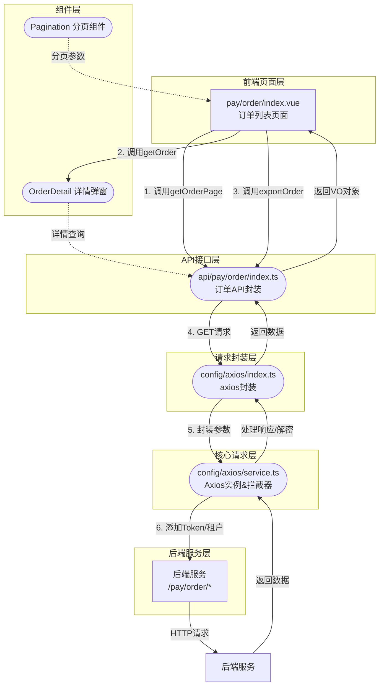
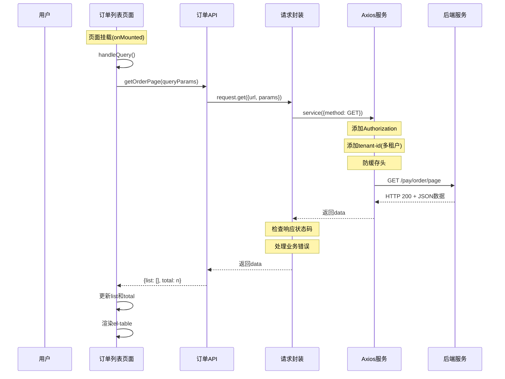
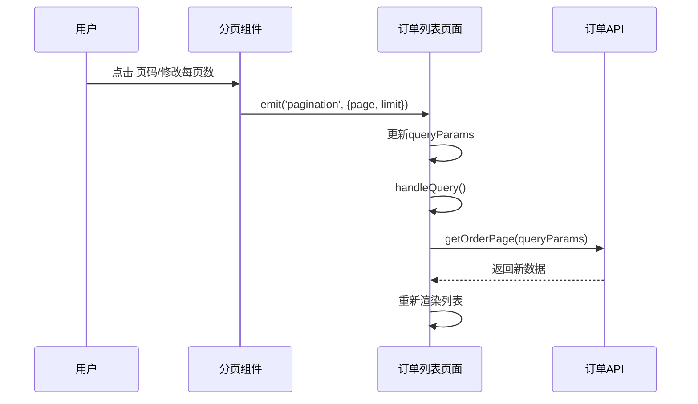
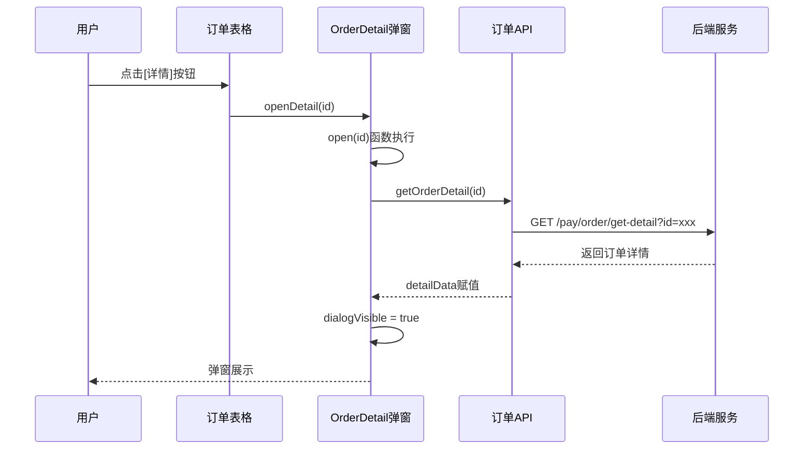

# 订单管理页面 - 订单信息请求逻辑技术解析文档

## 一、整体架构流程图



## 二、请求交互完整流程

### 2.1 列表数据请求流程



### 2.2 分页交互流程



### 2.3 详情查看流程



## 三、核心请求逻辑详解

### 3.1 API接口定义 (api/pay/order/index.ts)

```typescript
// 核心文件位置: src/api/pay/order/index.ts

// 查询列表支付订单 - GET请求
export const getOrderPage = async (params: OrderPageReqVO) => {
  return await request.get({ url: '/pay/order/page', params })
}

// 查询详情支付订单 - GET请求(可同步可异步)
export const getOrder = async (id: number, sync?: boolean) => {
  return await request.get({
    url: '/pay/order/get',
    params: { id, sync }
  })
}

// 获得支付订单的明细 - GET请求
export const getOrderDetail = async (id: number) => {
  return await request.get({ url: '/pay/order/get-detail?id=' + id })
}

// 提交支付订单 - POST请求
export const submitOrder = async (data: any) => {
  return await request.post({ url: '/pay/order/submit', data })
}

// 导出支付订单 - GET请求(特殊响应类型)
export const exportOrder = async (params: OrderExportReqVO) => {
  return await request.download({ url: '/pay/order/export-excel', params })
}
```

### 3.2 分页查询参数结构 (OrderPageReqVO)

```typescript
// 查询参数接口
interface OrderPageReqVO extends PageParam {
  merchantId?: number    // 商户ID
  appId?: number        // 应用ID
  channelId?: number   // 渠道ID
  channelCode?: string // 支付渠道(字典)
  merchantOrderId?: string // 商户单号
  subject?: string    // 商品标题
  body?: string      // 商品描述
  notifyUrl?: string // 通知URL
  notifyStatus?: number // 通知状态
  amount?: number     // 支付金额
  channelFeeRate?: number // 渠道费率
  channelFeeAmount?: number // 渠道费用
  status?: number    // 支付状态(字典)
  expireTime?: Date[] // 失效时间区间
  successTime?: Date[] // 支付时间区间
  notifyTime?: Date[] // 回调时间区间
  successExtensionId?: number // 成功扩展ID
  refundStatus?: number // 退款状态
  refundTimes?: number // 退款次数
  channelUserId?: string // 渠道用户ID
  channelOrderNo?: string // 渠道单号
  createTime?: Date[] // 创建时间区间
}

// 分页参数(由PageParam提供)
interface PageParam {
  pageNo: number // 页码(默认1)
  pageSize: number // 每页条数(默认10)
}
```

### 3.3 页面请求调用 (pay/order/index.vue)

```typescript
// 核心逻辑
const queryParams = reactive({
  pageNo: 1,
  pageSize: 10,
  appId: null,
  channelCode: null,
  merchantOrderId: null,
  channelOrderNo: null,
  no: null,
  status: null,
  createTime: []
})

// 查询列表
const getList = async () => {
  loading.value = true
  try {
    const data = await OrderApi.getOrderPage(queryParams)
    list.value = data.list
    total.value = data.total
  } finally {
    loading.value = false
  }
}

// 搜索按钮
const handleQuery = () => {
  queryParams.pageNo = 1  // 重置到第一页
  getList()
}

// 重置按钮
const resetQuery = () => {
  queryFormRef.value.resetFields()
  handleQuery()
}

// 导出功能
const handleExport = async () => {
  await message.exportConfirm()
  exportLoading.value = true
  const data = await OrderApi.exportOrder(queryParams)
  download.excel(data, '支付订单.xls')
  exportLoading.value = false
}
```

## 四、Axios请求封装详解

### 4.1 请求入口 (config/axios/index.ts)

```typescript
// 封装GET/POST/DELETE/PUT等方法
export default {
  get: async <T = any>(option: any) => {
    const res = await request({ method: 'GET', ...option })
    return res.data as unknown as T
  },
  post: async <T = any>(option: any) => {
    const res = await request({ method: 'POST', ...option })
    return res.data as unknown as T
  },
  download: async <T = any>(option: any) => {
    const res = await request({ method: 'GET', responseType: 'blob', ...option })
    return res as unknown as Promise<T>
  }
}
```

### 4.2 Axios实例配置 (config/axios/service.ts)

```typescript
// 创建实例
const service = axios.create({
  baseURL: base_url,      // API基础URL
  timeout: request_timeout, // 超时时间(30秒)
  withCredentials: false,
  paramsSerializer: (params) => qs.stringify(params, { allowDots: true })
})

// 请求拦截器 - 核心逻辑
service.interceptors.request.use(
  (config: InternalAxiosRequestConfig) => {
    // 1. Token处理
    if (getAccessToken() && !isToken) {
      config.headers.Authorization = 'Bearer ' + getAccessToken()
    }

    // 2. 多租户处理
    if (tenantEnable === 'true') {
      const tenantId = getTenantId()
      if (tenantId) config.headers['tenant-id'] = tenantId
    }

    // 3. GET请求防缓存
    if (method === 'GET') {
      config.headers['Cache-Control'] = 'no-cache'
      config.headers['Pragma'] = 'no-cache'
    }

    // 4. 请求数据加密(可选)
    if (isEncrypt && config.data) {
      config.data = ApiEncrypt.encryptRequest(config.data)
    }

    return config
  }
)
```

### 4.3 响应拦截处理

```typescript
// 响应拦截器
service.interceptors.response.use(
  async (response: AxiosResponse) => {
    const { data } = response
    const code = data.code || result_code  // 200为成功

    // Token过期自动刷新处理
    if (code === 401) {
      if (!isRefreshToken) {
        isRefreshToken = true
        // 尝试刷新token
        const refreshTokenRes = await refreshToken()
        setToken(refreshTokenRes.data.data)
        // 重放队列中的请求
        requestList.forEach(cb => cb())
        return service(config)
      } else {
        // 加入队列等待
        return new Promise(resolve => {
          requestList.push(() => resolve(service(config)))
        })
      }
    }

    // 业务错误处理
    if (code === 500) {
      ElMessage.error('服务器错误')
    }
    if (code !== 200) {
      ElNotification.error({ title: msg })
      return Promise.reject('error')
    }

    return data
  },
  (error: AxiosError) => {
    ElMessage.error('网络错误')
    return Promise.reject(error)
  }
)
```

### 4.4 请求配置 (config/axios/config.ts)

```typescript
const config = {
  // 基础URL = VITE_BASE_URL + VITE_API_URL
  base_url: import.meta.env.VITE_BASE_URL + import.meta.env.VITE_API_URL,

  // 成功状态码
  result_code: 200,

  // 默认请求头
  default_headers: 'application/json',

  // 超时时间(30秒)
  request_timeout: 30000
}
```

## 五、数据字典处理

### 5.1 字典工具 (utils/dict.ts)

```typescript
// 获取数字类型字典选项
export const getIntDictOptions = (dictType: string): NumberDictDataType[] => {
  const dictOptions = getDictOptions(dictType)
  return dictOptions.map(dict => ({
    ...dict,
    value: parseInt(dict.value + '')
  }))
}

// 获取字符串类型字典选项
export const getStrDictOptions = (dictType: string): StringDictDataType[] => {
  const dictOptions = getDictOptions(dictType)
  return dictOptions.map(dict => ({
    ...dict,
    value: dict.value + ''
  }))
}
```

### 5.2 订单相关字典

| 字典类型 | 说明 | 示例值 |
|---------|------|--------|
| PAY_ORDER_STATUS | 支付订单状态 | 0-待支付, 10-支付中, 20-支付成功, 30-支付失败, 40-已取消 |
| PAY_CHANNEL_CODE | 支付渠道 | alipay-wap-微信H5, wx_lite-微信小程序, wx_pub-微信公众号 |

## 六、核心数据流

### 6.1 列表数据流转

```
[queryParams]
    │
    ▼
[API层: getOrderPage]
    │
    ▼
[Axios: GET请求 + 参数序列化]
    │
    ▼
[请求拦截器: Token + 租户ID + 防缓存]
    │
    ▼
[后端: /pay/order/page]
    │
    ▼
[响应拦截器: 状态码检查 + 错误处理]
    │
    ▼
[data.list, data.total]
    │
    ▼
[el-table渲染, Pagination更新]
```

### 6.2 查询条件流转

```
搜索表单(el-form)
    │
    ▼ queryParams
        ├── appId: 应用编号
        ├── channelCode: 支付渠道
        ├── merchantOrderId: 商户单号
        ├── no: 支付单号
        ├── channelOrderNo: 渠道单号
        ├── status: 支付状态
        └── createTime: [开始日期, 结束日期]
    │
    ▼ GET /pay/order/page?pageNo=1&pageSize=10&appId=xxx&...
    │
    ▼ 后端分页查询
```

## 七、关键技术点总结

### 7.1 请求特点

| 特点 | 说明 |
|------|------|
| 防缓存 | GET请求自动添加Cache-Control: no-cache |
| 多租户 | 自动传递tenant-id请求头 |
| Token认证 | Bearer Token自动添加到Authorization |
| 参数序列化 | 使用qs序列化嵌套对象(allowDots) |
| 错误处理 | 统一的状态码处理和错误提示 |
| Token刷新 | 401时自动刷新Token并重放请求 |

### 7.2 分页机制

```
Pagination组件
    │
    ├── props: page, limit, total
    │
    ├── emit: pagination({page, limit})
    │
    └── v-model双向绑定
        ├── :page -> queryParams.pageNo
        └── :limit -> queryParams.pageSize
```

### 7.3 数据返回格式

```typescript
// 后端统一返回格式
{
  code: 200,        // 状态码
  msg: "success",  // 消息
  data: {          // 业务数据
    list: [       // 数据列表
      { id: 1, merchantOrderId: "xxx", ... }
    ],
    total: 100    // 总条数
  }
}
```

## 八、常见问题排查

### 8.1 请求发送失败

1. 检查Network面板HTTP状态码
2. 查看后端服务是否启动
3. 检查Authorization Token是否有效
4. 确认tenant-id是否正确

### 8.2 响应数据为空

1. 检查查询条件是否过于严格
2. 确认后端数据是否存在
3. 查看分页参数是否正确(pageNo/pageSize)

### 8.3 导出文件失败

1. 检查responseType是否为blob
2. 确认后端返回的是文件流
3. 检查错误处理逻辑(可能是JSON错误响应)

---

**文档版本**: v1.0
**创建时间**: 2024年
**适用项目**: ytsh-ui-vue3 (支付订单模块)