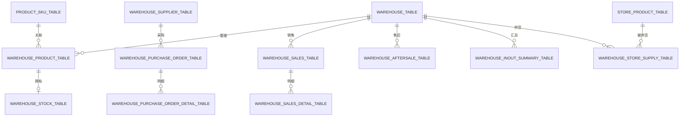

# 多仓维护功能设计方案（修订版）

## 一、设计理念与原则

### 1.1 核心目标
支持多个仓库的统一管理，每个仓库独立核算库存，实现采购入库、销售出库、售后处理等业务场景。

### 1.2 设计原则
- **仓库独立性**：每个仓库有独立的库存台账
- **库存可视化**：支持按仓库、SKU、分类等多个维度查看库存
- **业务完整性**：覆盖采购、销售、售后、进销汇总等核心业务
- **数据一致性**：库存变动有完整的流水记录，支持追溯

---

## 二、数据模型设计

### 2.1 核心实体关系



---

## 三、数据表结构（共11张）

### 3.1 仓库主表 (warehouse_table)

| 字段名 | 数据类型 | 是否为空 | 默认值 | 注释 |
|--------|----------|----------|--------|------|
| `warehouse_id` | varchar(50) | NOT NULL | - | 仓库ID（主键） |
| `warehouse_code` | varchar(50) | YES | NULL | 仓库编码 |
| `warehouse_name` | varchar(100) | YES | NULL | 仓库名称 |
| `warehouse_type` | varchar(20) | YES | NULL | 仓库类型 |
| `region_code` | varchar(50) | YES | NULL | 行政区划代码 |
| `address` | varchar(255) | YES | NULL | 详细地址 |
| `warehouse_status` | tinyint | YES | NULL | 仓库状态(0停用1正常) |
| `is_default` | tinyint | YES | NULL | 是否默认仓(0否1是) |
| `creator` | varchar(64) | YES | '' | 创建者 |
| `create_time` | datetime | YES | CURRENT_TIMESTAMP | 创建时间 |
| `updater` | varchar(64) | YES | '' | 更新者 |
| `update_time` | datetime | YES | CURRENT_TIMESTAMP | 更新时间 |
| `deleted` | tinyint(1) | NOT NULL | 0 | 逻辑删除 |
| `tenant_id` | bigint | NOT NULL | 1 | 租户编号 |

---

### 3.2 仓库供应商表 (warehouse_supplier_table)

| 字段名 | 数据类型 | 是否为空 | 默认值 | 注释 |
|--------|----------|----------|--------|------|
| `supplier_id` | varchar(50) | NOT NULL | - | 供应商ID（主键） |
| `supplier_name` | varchar(100) | YES | NULL | 供应商名称 |
| `category_name` | varchar(100) | YES | NULL | 供应商分类 |
| `manager_name` | varchar(50) | YES | NULL | 负责人 |
| `phone` | varchar(20) | YES | NULL | 电话 |
| `address` | varchar(255) | YES | NULL | 联系地址 |
| `payment_method` | varchar(50) | YES | NULL | 付款方式 |
| `payment_days` | int | YES | NULL | 账期天数 |
| `supplier_status` | tinyint | YES | NULL | 供应商状态(0停用1正常) |
| `creator` | varchar(64) | YES | '' | 创建者 |
| `create_time` | datetime | YES | CURRENT_TIMESTAMP | 创建时间 |
| `updater` | varchar(64) | YES | '' | 更新者 |
| `update_time` | datetime | YES | CURRENT_TIMESTAMP | 更新时间 |
| `deleted` | tinyint(1) | NOT NULL | 0 | 逻辑删除 |
| `tenant_id` | bigint | NOT NULL | 1 | 租户编号 |

---

### 3.3 仓库商品属性表 (warehouse_product_table)

| 字段名 | 数据类型 | 是否为空 | 默认值 | 注释 |
|--------|----------|----------|--------|------|
| `warehouse_product_id` | bigint | NOT NULL AUTO_INCREMENT | - | 仓库商品ID（主键） |
| `warehouse_id` | varchar(50) | YES | NULL | 仓库ID |
| `product_sku_id` | bigint | YES | NULL | 商品SKU ID |
| `warehouse_product_cost_price` | decimal(12,2) | YES | NULL | 该仓库采购价 |
| `warehouse_product_location` | varchar(50) | YES | NULL | 库位编码 |
| `warehouse_product_first_date` | date | YES | NULL | 首次有库存日期 |
| `warehouse_product_last_date` | date | YES | NULL | 最近入库日期 |
| `creator` | varchar(64) | YES | '' | 创建者 |
| `create_time` | datetime | YES | CURRENT_TIMESTAMP | 创建时间 |
| `updater` | varchar(64) | YES | '' | 更新者 |
| `update_time` | datetime | YES | CURRENT_TIMESTAMP | 更新时间 |
| `deleted` | tinyint(1) | NOT NULL | 0 | 逻辑删除 |
| `tenant_id` | bigint | NOT NULL | 1 | 租户编号 |

**唯一索引**：`uk_warehouse_product` (warehouse_id, product_sku_id)

---

### 3.4 仓库库存表 (warehouse_stock_table)

| 字段名 | 数据类型 | 是否为空 | 默认值 | 注释 |
|--------|----------|----------|--------|------|
| `warehouse_stock_id` | bigint | NOT NULL AUTO_INCREMENT | - | 仓库库存ID（主键） |
| `warehouse_product_id` | bigint | YES | NULL | 关联warehouse_product |
| `warehouse_stock_qty` | int | YES | NULL | 库存数量 |
| `warehouse_stock_available_qty` | int | YES | NULL | 可用量 |
| `warehouse_stock_transit_qty` | int | YES | NULL | 在途数量 |
| `warehouse_stock_frozen_qty` | int | YES | NULL | 冻结库存 |
| `warehouse_stock_outstock_hours` | int | YES | NULL | 缺货时长(小时) |
| `creator` | varchar(64) | YES | '' | 创建者 |
| `create_time` | datetime | YES | CURRENT_TIMESTAMP | 创建时间 |
| `updater` | varchar(64) | YES | '' | 更新者 |
| `update_time` | datetime | YES | CURRENT_TIMESTAMP | 更新时间 |
| `deleted` | tinyint(1) | NOT NULL | 0 | 逻辑删除 |
| `tenant_id` | bigint | NOT NULL | 1 | 租户编号 |

---

### 3.5 仓库采购订单表 (warehouse_purchase_order_table)

| 字段名 | 数据类型 | 是否为空 | 默认值 | 注释 |
|--------|----------|----------|--------|------|
| `purchase_order_id` | bigint | NOT NULL AUTO_INCREMENT | - | 采购订单ID（主键） |
| `purchase_order_no` | varchar(50) | YES | NULL | 采购单号 |
| `supplier_id` | varchar(50) | YES | NULL | 供应商ID |
| `supplier_name` | varchar(100) | YES | NULL | 供应商名称 |
| `warehouse_id` | varchar(50) | YES | NULL | 收货仓库ID |
| `purchase_date` | date | YES | NULL | 采购日期 |
| `order_status` | varchar(20) | YES | NULL | 订单状态 |
| `receive_status` | varchar(20) | YES | NULL | 收货状态 |
| `total_qty` | int | YES | NULL | 总商品量 |
| `total_amount` | decimal(12,2) | YES | NULL | 总金额 |
| `total_inbound_qty` | int | YES | NULL | 总入库数 |
| `diff_qty` | int | YES | NULL | 差异数 |
| `return_qty` | int | YES | NULL | 退货数 |
| `purchaser` | varchar(50) | YES | NULL | 采购员 |
| `receive_address` | varchar(255) | YES | NULL | 收货地址 |
| `audit_date` | date | YES | NULL | 审核日期 |
| `remark` | varchar(500) | YES | NULL | 备注 |
| `creator` | varchar(64) | YES | '' | 创建者 |
| `create_time` | datetime | YES | CURRENT_TIMESTAMP | 创建时间 |
| `updater` | varchar(64) | YES | '' | 更新者 |
| `update_time` | datetime | YES | CURRENT_TIMESTAMP | 更新时间 |
| `deleted` | tinyint(1) | NOT NULL | 0 | 逻辑删除 |
| `tenant_id` | bigint | NOT NULL | 1 | 租户编号 |

---

### 3.6 仓库采购订单明细表 (warehouse_purchase_order_detail_table)

| 字段名 | 数据类型 | 是否为空 | 默认值 | 注释 |
|--------|----------|----------|--------|------|
| `detail_id` | bigint | NOT NULL AUTO_INCREMENT | - | 明细ID（主键） |
| `purchase_order_id` | bigint | YES | NULL | 采购订单ID |
| `purchase_order_no` | varchar(50) | YES | NULL | 采购单号 |
| `product_sku_id` | bigint | YES | NULL | 商品SKU ID |
| `product_sku_code` | varchar(50) | YES | NULL | 商品编码 |
| `product_sku_name` | varchar(200) | YES | NULL | 商品名称 |
| `purchase_qty` | int | YES | NULL | 采购数量 |
| `box_qty` | int | YES | NULL | 箱数 |
| `standard_box_qty` | int | YES | NULL | 标准装箱数量 |
| `purchase_price` | decimal(12,2) | YES | NULL | 采购单价 |
| `purchase_amount` | decimal(12,2) | YES | NULL | 采购金额 |
| `inbound_qty` | int | YES | NULL | 已入库数量 |
| `return_qty` | int | YES | NULL | 退货数 |
| `diff_qty` | int | YES | NULL | 差异数 |
| `creator` | varchar(64) | YES | '' | 创建者 |
| `create_time` | datetime | YES | CURRENT_TIMESTAMP | 创建时间 |
| `updater` | varchar(64) | YES | '' | 更新者 |
| `update_time` | datetime | YES | CURRENT_TIMESTAMP | 更新时间 |
| `deleted` | tinyint(1) | NOT NULL | 0 | 逻辑删除 |
| `tenant_id` | bigint | NOT NULL | 1 | 租户编号 |

---

### 3.7 仓库销售表 (warehouse_sales_table)

| 字段名 | 数据类型 | 是否为空 | 默认值 | 注释 |
|--------|----------|----------|--------|------|
| `sales_id` | bigint | NOT NULL AUTO_INCREMENT | - | 销售ID（主键） |
| `internal_order_no` | varchar(64) | YES | NULL | 内部订单号 |
| `platform_order_no` | varchar(64) | YES | NULL | 线上订单号 |
| `warehouse_id` | varchar(50) | YES | NULL | 发货仓ID |
| `warehouse_name` | varchar(100) | YES | NULL | 发货仓名称 |
| `store_id` | varchar(50) | YES | NULL | 店铺ID |
| `store_name` | varchar(100) | YES | NULL | 店铺名称 |
| `buyer_id` | varchar(50) | YES | NULL | 买家ID |
| `buyer_account` | varchar(100) | YES | NULL | 买家账号 |
| `order_status` | varchar(20) | YES | NULL | 订单状态 |
| `order_source` | varchar(50) | YES | NULL | 订单来源 |
| `order_date` | date | YES | NULL | 订单日期 |
| `pay_date` | date | YES | NULL | 付款日期 |
| `deliver_date` | date | YES | NULL | 发货日期 |
| `confirm_date` | date | YES | NULL | 确认收货日期 |
| `salesman` | varchar(50) | YES | NULL | 业务员 |
| `receiver_name` | varchar(50) | YES | NULL | 收货人 |
| `receiver_phone` | varchar(20) | YES | NULL | 收货人电话 |
| `province` | varchar(50) | YES | NULL | 省 |
| `city` | varchar(50) | YES | NULL | 市 |
| `district` | varchar(50) | YES | NULL | 区县 |
| `address` | varchar(255) | YES | NULL | 详细地址 |
| `express_company` | varchar(50) | YES | NULL | 快递公司 |
| `express_no` | varchar(50) | YES | NULL | 快递单号 |
| `total_sale_amount` | decimal(12,2) | YES | NULL | 销售总金额 |
| `total_deliver_amount` | decimal(12,2) | YES | NULL | 实发总金额 |
| `total_return_amount` | decimal(12,2) | YES | NULL | 退货总金额 |
| `total_profit` | decimal(12,2) | YES | NULL | 销售总毛利 |
| `remark` | varchar(500) | YES | NULL | 备注 |
| `creator` | varchar(64) | YES | '' | 创建者 |
| `create_time` | datetime | YES | CURRENT_TIMESTAMP | 创建时间 |
| `updater` | varchar(64) | YES | '' | 更新者 |
| `update_time` | datetime | YES | CURRENT_TIMESTAMP | 更新时间 |
| `deleted` | tinyint(1) | NOT NULL | 0 | 逻辑删除 |
| `tenant_id` | bigint | NOT NULL | 1 | 租户编号 |

---

### 3.8 仓库销售明细表 (warehouse_sales_detail_table)

| 字段名 | 数据类型 | 是否为空 | 默认值 | 注释 |
|--------|----------|----------|--------|------|
| `detail_id` | bigint | NOT NULL AUTO_INCREMENT | - | 明细ID（主键） |
| `sales_id` | bigint | YES | NULL | 销售ID |
| `product_sku_id` | bigint | YES | NULL | 商品SKU ID |
| `product_sku_code` | varchar(50) | YES | NULL | 商品编码 |
| `product_sku_name` | varchar(200) | YES | NULL | 商品名称(冗余) |
| `sale_qty` | int | YES | NULL | 销售数量 |
| `zero_price_qty` | int | YES | NULL | 价格为零的商品数量 |
| `unit_price` | decimal(12,2) | YES | NULL | 单价 |
| `sale_amount` | decimal(12,2) | YES | NULL | 销售金额 |
| `sale_cost` | decimal(12,2) | YES | NULL | 销售成本 |
| `actual_deliver_qty` | int | YES | NULL | 实发数量 |
| `actual_deliver_amount` | decimal(12,2) | YES | NULL | 实发金额 |
| `actual_deliver_cost` | decimal(12,2) | YES | NULL | 实发成本 |
| `sale_profit` | decimal(12,2) | YES | NULL | 销售毛利 |
| `return_qty` | int | YES | NULL | 退货数量 |
| `actual_return_qty` | int | YES | NULL | 实退数量 |
| `return_amount` | decimal(12,2) | YES | NULL | 退货金额 |
| `return_cost` | decimal(12,2) | YES | NULL | 退货成本 |
| `actual_return_amount` | decimal(12,2) | YES | NULL | 实退金额 |
| `actual_return_cost` | decimal(12,2) | YES | NULL | 实退成本 |
| `creator` | varchar(64) | YES | '' | 创建者 |
| `create_time` | datetime | YES | CURRENT_TIMESTAMP | 创建时间 |
| `updater` | varchar(64) | YES | '' | 更新者 |
| `update_time` | datetime | YES | CURRENT_TIMESTAMP | 更新时间 |
| `deleted` | tinyint(1) | NOT NULL | 0 | 逻辑删除 |
| `tenant_id` | bigint | NOT NULL | 1 | 租户编号 |

---

### 3.9 仓库售后表 (warehouse_aftersale_table)

| 字段名 | 数据类型 | 是否为空 | 默认值 | 注释 |
|--------|----------|----------|--------|------|
| `aftersale_id` | bigint | NOT NULL AUTO_INCREMENT | - | 售后ID（主键） |
| `aftersale_no` | varchar(50) | YES | NULL | 售后单号 |
| `internal_order_no` | varchar(64) | YES | NULL | 关联内部订单号 |
| `platform_order_no` | varchar(64) | YES | NULL | 关联线上订单号 |
| `warehouse_id` | varchar(50) | YES | NULL | 发货仓编码 |
| `aftersale_category` | varchar(50) | YES | NULL | 售后分类 |
| `issue_type` | varchar(50) | YES | NULL | 问题类型 |
| `aftersale_status` | varchar(20) | YES | NULL | 售后状态 |
| `register_date` | date | YES | NULL | 售后登记日期 |
| `confirm_date` | date | YES | NULL | 售后确认日期 |
| `inbound_date` | date | YES | NULL | 售后进仓日期 |
| `inbound_no` | varchar(50) | YES | NULL | 售后进仓单号 |
| `product_sku_id` | bigint | YES | NULL | 商品SKU ID |
| `product_sku_code` | varchar(50) | YES | NULL | 商品编码 |
| `product_sku_name` | varchar(200) | YES | NULL | 商品名称 |
| `return_qty` | int | YES | NULL | 退货数量 |
| `refund_amount` | decimal(12,2) | YES | NULL | 退款金额 |
| `remark` | varchar(500) | YES | NULL | 备注 |
| `creator` | varchar(64) | YES | '' | 创建者 |
| `create_time` | datetime | YES | CURRENT_TIMESTAMP | 创建时间 |
| `updater` | varchar(64) | YES | '' | 更新者 |
| `update_time` | datetime | YES | CURRENT_TIMESTAMP | 更新时间 |
| `deleted` | tinyint(1) | NOT NULL | 0 | 逻辑删除 |
| `tenant_id` | bigint | NOT NULL | 1 | 租户编号 |

---

### 3.10 仓库进销汇总表 (warehouse_inout_summary_table)

| 字段名 | 数据类型 | 是否为空 | 默认值 | 注释 |
|--------|----------|----------|--------|------|
| `summary_id` | bigint | NOT NULL AUTO_INCREMENT | - | 汇总ID（主键） |
| `product_sku_id` | bigint | YES | NULL | 商品SKU ID |
| `warehouse_id` | varchar(50) | YES | NULL | 仓库ID |
| `period_type` | varchar(20) | YES | NULL | 周期类型(MONTH月/WEEK周) |
| `period_code` | varchar(20) | YES | NULL | 周期编码(如:202503) |
| `opening_qty` | int | YES | NULL | 期初数量 |
| `closing_qty` | int | YES | NULL | 期末数量 |
| `purchase_return_qty` | int | YES | NULL | 采购退货数量 |
| `purchase_inbound_qty` | int | YES | NULL | 采购进仓数量 |
| `sales_outbound_qty` | int | YES | NULL | 销售出仓数量 |
| `sales_return_qty` | int | YES | NULL | 销售退货数量 |
| `inventory_check_qty` | int | YES | NULL | 盘点数量 |
| `transfer_out_qty` | int | YES | NULL | 调拨出数量 |
| `transfer_in_qty` | int | YES | NULL | 调拨入数量 |
| `creator` | varchar(64) | YES | '' | 创建者 |
| `create_time` | datetime | YES | CURRENT_TIMESTAMP | 创建时间 |
| `updater` | varchar(64) | YES | '' | 更新者 |
| `update_time` | datetime | YES | CURRENT_TIMESTAMP | 更新时间 |
| `deleted` | tinyint(1) | NOT NULL | 0 | 逻辑删除 |
| `tenant_id` | bigint | NOT NULL | 1 | 租户编号 |

---

### 3.11 门店SKU供货关系表 (warehouse_store_supply_table)

| 字段名 | 数据类型 | 是否为空 | 默认值 | 注释 |
|--------|----------|----------|--------|------|
| `supply_id` | bigint | NOT NULL AUTO_INCREMENT | - | 供货关系ID（主键） |
| `store_product_id` | bigint | YES | NULL | 门店商品ID |
| `warehouse_id` | varchar(50) | YES | NULL | 供货仓库ID |
| `supply_is_primary` | tinyint | YES | NULL | 是否主供货仓(0否1是) |
| `supply_is_active` | tinyint | YES | NULL | 是否供货(0否1是) |
| `supply_status` | varchar(20) | YES | NULL | 供货状态 |
| `creator` | varchar(64) | YES | '' | 创建者 |
| `create_time` | datetime | YES | CURRENT_TIMESTAMP | 创建时间 |
| `updater` | varchar(64) | YES | '' | 更新者 |
| `update_time` | datetime | YES | CURRENT_TIMESTAMP | 更新时间 |
| `deleted` | tinyint(1) | NOT NULL | 0 | 逻辑删除 |
| `tenant_id` | bigint | NOT NULL | 1 | 租户编号 |

---

## 四、文件结构与命名规范

### 4.1 后端 Java 文件结构

```
yudao-module-business/src/main/java/cn/iocoder/yudao/module/business/
├── controller/admin/warehouse/
│   ├── WarehouseController.java                    # 仓库管理
│   ├── WarehouseSupplierController.java          # 供应商管理
│   ├── WarehouseProductController.java           # 仓库商品
│   ├── WarehouseStockController.java              # 仓库库存
│   ├── WarehousePurchaseController.java          # 采购订单
│   ├── WarehouseSalesController.java             # 销售订单
│   ├── WarehouseAftersaleController.java         # 售后管理
│   ├── WarehouseInoutSummaryController.java      # 进销汇总
│   └── vo/
│       ├── WarehousePageReqVO.java
│       ├── WarehouseSaveReqVO.java
│       ├── WarehouseRespVO.java
│       ├── WarehouseSimpleRespVO.java
│       ├── WarehouseSupplierPageReqVO.java
│       ├── WarehouseSupplierSaveReqVO.java
│       ├── WarehouseSupplierRespVO.java
│       ├── WarehouseProductRespVO.java
│       ├── WarehouseStockRespVO.java
│       ├── WarehousePurchasePageReqVO.java
│       ├── WarehousePurchaseSaveReqVO.java
│       ├── WarehousePurchaseRespVO.java
│       ├── WarehousePurchaseDetailRespVO.java
│       ├── WarehouseSalesPageReqVO.java
│       ├── WarehouseSalesRespVO.java
│       ├── WarehouseSalesDetailRespVO.java
│       ├── WarehouseAftersalePageReqVO.java
│       ├── WarehouseAftersaleSaveReqVO.java
│       ├── WarehouseAftersaleRespVO.java
│       ├── WarehouseInoutSummaryPageReqVO.java
│       ├── WarehouseInoutSummaryRespVO.java
│       └── WarehouseStoreSupplyRespVO.java
├── service/warehouse/
│   ├── WarehouseService.java
│   ├── WarehouseServiceImpl.java
│   ├── WarehouseSupplierService.java
│   ├── WarehouseSupplierServiceImpl.java
│   ├── WarehouseProductService.java
│   ├── WarehouseProductServiceImpl.java
│   ├── WarehouseStockService.java
│   ├── WarehouseStockServiceImpl.java
│   ├── WarehousePurchaseService.java
│   ├── WarehousePurchaseServiceImpl.java
│   ├── WarehouseSalesService.java
│   ├── WarehouseSalesServiceImpl.java
│   ├── WarehouseAftersaleService.java
│   ├── WarehouseAftersaleServiceImpl.java
│   ├── WarehouseInoutSummaryService.java
│   └── WarehouseInoutSummaryServiceImpl.java
├── dal/mysql/warehouse/
│   ├── WarehouseMapper.java
│   ├── WarehouseSupplierMapper.java
│   ├── WarehouseProductMapper.java
│   ├── WarehouseStockMapper.java
│   ├── WarehousePurchaseMapper.java
│   ├── WarehousePurchaseDetailMapper.java
│   ├── WarehouseSalesMapper.java
│   ├── WarehouseSalesDetailMapper.java
│   ├── WarehouseAftersaleMapper.java
│   ├── WarehouseInoutSummaryMapper.java
│   └── WarehouseStoreSupplyMapper.java
├── dal/dataobject/warehouse/
│   ├── WarehouseDO.java
│   ├── WarehouseSupplierDO.java
│   ├── WarehouseProductDO.java
│   ├── WarehouseStockDO.java
│   ├── WarehousePurchaseDO.java
│   ├── WarehousePurchaseDetailDO.java
│   ├── WarehouseSalesDO.java
│   ├── WarehouseSalesDetailDO.java
│   ├── WarehouseAftersaleDO.java
│   ├── WarehouseInoutSummaryDO.java
│   └── WarehouseStoreSupplyDO.java
└── resources/mapper/warehouse/
    ├── WarehouseMapper.xml
    ├── WarehouseSupplierMapper.xml
    ├── WarehouseProductMapper.xml
    ├── WarehouseStockMapper.xml
    ├── WarehousePurchaseMapper.xml
    ├── WarehousePurchaseDetailMapper.xml
    ├── WarehouseSalesMapper.xml
    ├── WarehouseSalesDetailMapper.xml
    ├── WarehouseAftersaleMapper.xml
    ├── WarehouseInoutSummaryMapper.xml
    └── WarehouseStoreSupplyMapper.xml
```

### 4.2 前端 Vue 文件结构

```
ytsh-ui-vue3/src/
├── api/business/warehouse/
│   ├── index.ts
│   ├── supplier.ts
│   ├── product.ts
│   ├── stock.ts
│   ├── purchase.ts
│   ├── sales.ts
│   ├── aftersale.ts
│   └── inout-summary.ts
└── views/business/
    └── warehouse/
        ├── index.vue                    # 仓库管理主页
        ├── supplier/
        │   ├── index.vue                # 供应商列表
        │   └── SupplierForm.vue        # 供应商表单
        ├── product/
        │   └── index.vue                # 仓库商品管理
        ├── stock/
        │   └── index.vue                # 仓库库存管理
        ├── purchase/
        │   ├── index.vue                # 采购订单列表
        │   ├── PurchaseForm.vue         # 采购订单表单
        │   └── PurchaseDetail.vue       # 采购订单明细
        ├── sales/
        │   ├── index.vue                # 销售订单列表
        │   └── SalesDetail.vue          # 销售订单明细
        ├── aftersale/
        │   ├── index.vue               # 售后列表
        │   └── AftersaleForm.vue        # 售后表单
        └── inout-summary/
            └── index.vue                # 进销汇总
```

---

## 五、API 接口设计

### 5.1 仓库管理

| 接口 | 方法 | 说明 |
|------|------|------|
| `/warehouse/page` | GET | 分页查询仓库 |
| `/warehouse/create` | POST | 创建仓库 |
| `/warehouse/update` | PUT | 修改仓库 |
| `/warehouse/delete/{id}` | DELETE | 删除仓库 |
| `/warehouse/simple-list` | GET | 获取仓库简单列表 |
| `/warehouse/get/{id}` | GET | 获取仓库详情 |

### 5.2 供应商管理

| 接口 | 方法 | 说明 |
|------|------|------|
| `/warehouse-supplier/page` | GET | 分页查询供应商 |
| `/warehouse-supplier/create` | POST | 创建供应商 |
| `/warehouse-supplier/update` | PUT | 修改供应商 |
| `/warehouse-supplier/delete/{id}` | DELETE | 删除供应商 |
| `/warehouse-supplier/simple-list` | GET | 获取供应商简单列表 |

### 5.3 仓库商品

| 接口 | 方法 | 说明 |
|------|------|------|
| `/warehouse-product/page` | GET | 分页查询仓库商品 |
| `/warehouse-product/create` | POST | 添加仓库商品 |
| `/warehouse-product/update` | PUT | 修改仓库商品 |
| `/warehouse-product/delete/{id}` | DELETE | 删除仓库商品 |
| `/warehouse-product/get-by-warehouse/{warehouseId}` | GET | 获取某仓库商品列表 |

### 5.4 仓库库存

| 接口 | 方法 | 说明 |
|------|------|------|
| `/warehouse-stock/page` | GET | 分页查询仓库库存 |
| `/warehouse-stock/get/{id}` | GET | 获取库存详情 |
| `/warehouse-stock/statistics` | GET | 获取仓库统计 |
| `/warehouse-stock/export` | GET | 导出库存 |

### 5.5 采购订单

| 接口 | 方法 | 说明 |
|------|------|------|
| `/warehouse-purchase/page` | GET | 分页查询采购订单 |
| `/warehouse-purchase/create` | POST | 创建采购订单 |
| `/warehouse-purchase/update` | PUT | 修改采购订单 |
| `/warehouse-purchase/delete/{id}` | DELETE | 删除采购订单 |
| `/warehouse-purchase/get/{id}` | GET | 获取采购订单详情 |
| `/warehouse-purchase/submit/{id}` | PUT | 提交采购订单 |
| `/warehouse-purchase/confirm-inbound/{id}` | PUT | 确认入库 |

### 5.6 销售订单

| 接口 | 方法 | 说明 |
|------|------|------|
| `/warehouse-sales/page` | GET | 分页查询销售订单 |
| `/warehouse-sales/create` | POST | 创建销售订单 |
| `/warehouse-sales/update` | PUT | 修改销售订单 |
| `/warehouse-sales/delete/{id}` | DELETE | 删除销售订单 |
| `/warehouse-sales/get/{id}` | GET | 获取销售订单详情 |
| `/warehouse-sales/deliver/{id}` | PUT | 发货 |

### 5.7 售后管理

| 接口 | 方法 | 说明 |
|------|------|------|
| `/warehouse-aftersale/page` | GET | 分页查询售后 |
| `/warehouse-aftersale/create` | POST | 创建售后单 |
| `/warehouse-aftersale/update` | PUT | 修改售后单 |
| `/warehouse-aftersale/delete/{id}` | DELETE | 删除售后单 |
| `/warehouse-aftersale/get/{id}` | GET | 获取售后详情 |
| `/warehouse-aftersale/confirm-inbound/{id}` | PUT | 确认入库 |

### 5.8 进销汇总

| 接口 | 方法 | 说明 |
|------|------|------|
| `/warehouse-inout-summary/page` | GET | 分页查询进销汇总 |
| `/warehouse-inout-summary/get-by-warehouse/{warehouseId}` | GET | 获取某仓库进销汇总 |
| `/warehouse-inout-summary/generate` | POST | 生成汇总数据 |

### 5.9 供货关系

| 接口 | 方法 | 说明 |
|------|------|------|
| `/warehouse-store-supply/page` | GET | 分页查询供货关系 |
| `/warehouse-store-supply/create` | POST | 创建供货关系 |
| `/warehouse-store-supply/update` | PUT | 修改供货关系 |
| `/warehouse-store-supply/delete/{id}` | DELETE | 删除供货关系 |
| `/warehouse-store-supply/set-primary` | PUT | 设置主供货仓 |
| `/warehouse-store-supply/get-by-store-product/{storeProductId}` | GET | 获取某门店商品的供货关系 |

---

## 六、菜单结构设计

### 6.1 菜单层级

```
仓库管理 (目录, ID: 5080)
├── 仓库信息管理 (菜单, ID: 5081)
├── 供应商管理 (菜单, ID: 5082)
├── 仓库商品管理 (菜单, ID: 5083)
├── 仓库库存管理 (菜单, ID: 5084)
├── 采购订单管理 (菜单, ID: 5085)
├── 销售订单管理 (菜单, ID: 5086)
├── 售后管理 (菜单, ID: 5087)
└── 进销汇总 (菜单, ID: 5088)
```

### 6.2 菜单 SQL

```sql
-- 仓库管理目录
INSERT INTO `system_menu` (`id`, `name`, `permission`, `type`, `sort`, `parent_id`, `path`, `icon`, `component`, `component_name`, `status`, `visible`, `keep_alive`, `always_show`, `creator`, `create_time`, `updater`, `update_time`, `deleted`)
VALUES (5080, '仓库管理', '', 1, 5, 5049, 'warehouse', 'ep:box', '#', NULL, 0, b'1', b'1', b'1', 'admin', NOW(), 'admin', NOW(), b'0');

-- 仓库信息管理
INSERT INTO `system_menu` (`id`, `name`, `permission`, `type`, `sort`, `parent_id`, `path`, `icon`, `component`, `component_name`, `status`, `visible`, `keep_alive`, `always_show`, `creator`, `create_time`, `updater`, `update_time`, `deleted`)
VALUES (5081, '仓库信息管理', '', 2, 1, 5080, 'warehouse', 'ep:office', 'business/warehouse/index', 'Warehouse', 0, b'1', b'1', b'1', 'admin', NOW(), 'admin', NOW(), b'0');

-- 供应商管理
INSERT INTO `system_menu` (`id`, `name`, `permission`, `type`, `sort`, `parent_id`, `path`, `icon`, `component`, `component_name`, `status`, `visible`, `keep_alive`, `always_show`, `creator`, `create_time`, `updater`, `update_time`, `deleted`)
VALUES (5082, '供应商管理', '', 2, 2, 5080, 'warehouse-supplier', 'ep:company', 'business/warehouse/supplier/index', 'WarehouseSupplier', 0, b'1', b'1', b'1', 'admin', NOW(), 'admin', NOW(), b'0');

-- 仓库商品管理
INSERT INTO `system_menu` (`id`, `name`, `permission`, `type`, `sort`, `parent_id`, `path`, `icon`, `component`, `component_name`, `status`, `visible`, `keep_alive`, `always_show`, `creator`, `create_time`, `updater`, `update_time`, `deleted`)
VALUES (5083, '仓库商品管理', '', 2, 3, 5080, 'warehouse-product', 'ep:goods', 'business/warehouse/product/index', 'WarehouseProduct', 0, b'1', b'1', b'1', 'admin', NOW(), 'admin', NOW(), b'0');

-- 仓库库存管理
INSERT INTO `system_menu` (`id`, `name`, `permission`, `type`, `sort`, `parent_id`, `path`, `icon`, `component`, `component_name`, `status`, `visible`, `keep_alive`, `always_show`, `creator`, `create_time`, `updater`, `update_time`, `deleted`)
VALUES (5084, '仓库库存管理', '', 2, 4, 5080, 'warehouse-stock', 'ep:document', 'business/warehouse/stock/index', 'WarehouseStock', 0, b'1', b'1', b'1', 'admin', NOW(), 'admin', NOW(), b'0');

-- 采购订单管理
INSERT INTO `system_menu` (`id`, `name`, `permission`, `type`, `sort`, `parent_id`, `path`, `icon`, `component`, `component_name`, `status`, `visible`, `keep_alive`, `always_show`, `creator`, `create_time`, `updater`, `update_time`, `deleted`)
VALUES (5085, '采购订单管理', '', 2, 5, 5080, 'warehouse-purchase', 'ep:shopping', 'business/warehouse/purchase/index', 'WarehousePurchase', 0, b'1', b'1', b'1', 'admin', NOW(), 'admin', NOW(), b'0');

-- 销售订单管理
INSERT INTO `system_menu` (`id`, `name`, `permission`, `type`, `sort`, `parent_id`, `path`, `icon`, `component`, `component_name`, `status`, `visible`, `keep_alive`, `always_show`, `creator`, `create_time`, `updater`, `update_time`, `deleted`)
VALUES (5086, '销售订单管理', '', 2, 6, 5080, 'warehouse-sales', 'ep:sell', 'business/warehouse/sales/index', 'WarehouseSales', 0, b'1', b'1', b'1', 'admin', NOW(), 'admin', NOW(), b'0');

-- 售后管理
INSERT INTO `system_menu` (`id`, `name`, `permission`, `type`, `sort`, `parent_id`, `path`, `icon`, `component`, `component_name`, `status`, `visible`, `keep_alive`, `always_show`, `creator`, `create_time`, `updater`, `update_time`, `deleted`)
VALUES (5087, '售后管理', '', 2, 7, 5080, 'warehouse-aftersale', 'ep:warning', 'business/warehouse/aftersale/index', 'WarehouseAftersale', 0, b'1', b'1', b'1', 'admin', NOW(), 'admin', NOW(), b'0');

-- 进销汇总
INSERT INTO `system_menu` (`id`, `name`, `permission`, `type`, `sort`, `parent_id`, `path`, `icon`, `component`, `component_name`, `status`, `visible`, `keep_alive`, `always_show`, `creator`, `create_time`, `updater`, `update_time`, `deleted`)
VALUES (5088, '进销汇总', '', 2, 8, 5080, 'warehouse-inout-summary', 'ep:data-analysis', 'business/warehouse/inout-summary/index', 'WarehouseInoutSummary', 0, b'1', b'1', b'1', 'admin', NOW(), 'admin', NOW(), b'0');
```

---

## 七、业务流程说明

### 7.1 采购入库流程

```
1. 创建采购订单（选择供应商、商品、数量）
2. 提交采购订单（状态：待审核）
3. 审核通过后，确认入库
4. 系统自动：
   - 更新仓库库存（warehouse_stock_table）
   - 更新仓库商品信息（首次有库存日期、最近入库日期）
5. 采购入库完成
```

### 7.2 销售出库流程

```
1. 创建销售订单（关联内部/平台订单号，选择仓库、商品）
2. 发货操作（填写快递信息）
3. 系统自动：
   - 更新仓库库存（扣减可用量）
4. 销售出库完成
```

### 7.3 售后退货流程

```
1. 创建售后单（关联原销售订单，选择商品、退货数量）
2. 确认售后入库（状态：待入库 → 已入库）
3. 系统自动：
   - 增加仓库库存
4. 售后处理完成
```

---

## 八、命名规范汇总

### 8.1 类名命名规范

| 实体类型 | 命名格式 | 示例 |
|---------|---------|------|
| DO 实体 | `XxxDO` | `WarehouseDO` |
| Mapper | `XxxMapper` | `WarehouseMapper` |
| Service 接口 | `XxxService` | `WarehouseService` |
| Service 实现 | `XxxServiceImpl` | `WarehouseServiceImpl` |
| Controller | `XxxController` | `WarehouseController` |
| 分页请求 VO | `XxxPageReqVO` | `WarehousePageReqVO` |
| 创建/修改请求 VO | `XxxSaveReqVO` | `WarehouseSaveReqVO` |
| 响应 VO | `XxxRespVO` | `WarehouseRespVO` |
| 简单响应 VO | `XxxSimpleRespVO` | `WarehouseSimpleRespVO` |

### 8.2 表名命名规范

| 表类型 | 命名格式 | 示例 |
|-------|---------|------|
| 主表 | `xxx_table` | `warehouse_table` |
| 关联表 | `xxx_table` | `warehouse_product_table` |
| 明细表 | `xxx_table` | `warehouse_purchase_detail_table` |

### 8.3 字段命名规范

| 字段类型 | 命名格式 | 示例 |
|---------|---------|------|
| ID 主键 | `xxx_id` | `warehouse_id` |
| 外键 | `xxx_id` | `product_sku_id` |
| 编码 | `xxx_no` | `purchase_order_no` |
| 名称 | `xxx_name` | `warehouse_name` |
| 状态 | `xxx_status` | `order_status` |
| 数量 | `xxx_qty` | `purchase_qty` |
| 金额 | `xxx_amount` | `total_amount` |
| 日期 | `xxx_date` | `purchase_date` |
| 时间 | `xxx_time` | `create_time` |

---

## 九、状态值定义

### 9.1 仓库状态 (warehouse_status)

| 值 | 说明 |
|---|------|
| 0 | 停用 |
| 1 | 正常 |

### 9.2 供应商状态 (supplier_status)

| 值 | 说明 |
|---|------|
| 0 | 停用 |
| 1 | 正常 |

### 9.3 采购订单状态 (order_status)

| 值 | 说明 |
|---|------|
| 1 | 待审核 |
| 2 | 已审核 |
| 3 | 已入库 |
| 4 | 已完成 |
| 5 | 已取消 |

### 9.4 采购收货状态 (receive_status)

| 值 | 说明 |
|---|------|
| 1 | 待收货 |
| 2 | 部分收货 |
| 3 | 已收货 |
| 4 | 有差异 |

### 9.5 销售订单状态 (order_status)

| 值 | 说明 |
|---|------|
| 1 | 待付款 |
| 2 | 已付款 |
| 3 | 已发货 |
| 4 | 已收货 |
| 5 | 已取消 |
| 6 | 已退货 |

### 9.6 售后状态 (aftersale_status)

| 值 | 说明 |
|---|------|
| 1 | 待处理 |
| 2 | 处理中 |
| 3 | 已入库 |
| 4 | 已退款 |
| 5 | 已拒绝 |

### 9.7 售后分类 (aftersale_category)

| 值 | 说明 |
|---|------|
| 1 | 退货 |
| 2 | 换货 |
| 3 | 维修 |
| 4 | 补发 |

### 9.8 问题类型 (issue_type)

| 值 | 说明 |
|---|------|
| 1 | 商品损坏 |
| 2 | 商品错发 |
| 3 | 商品少件 |
| 4 | 商品质量问题 |
| 5 | 其他 |
