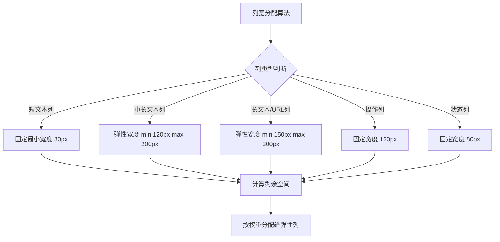
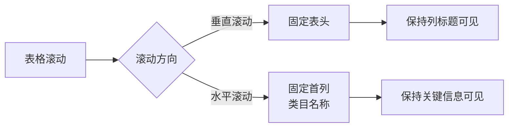
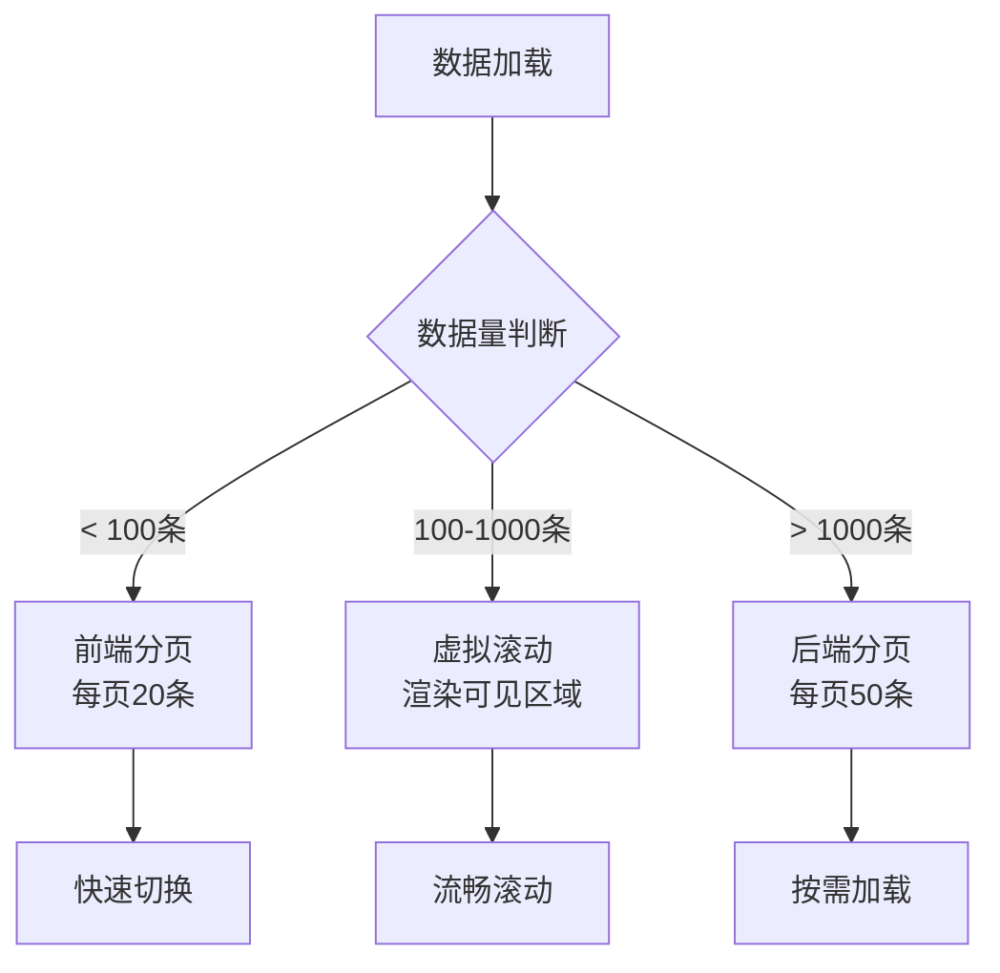
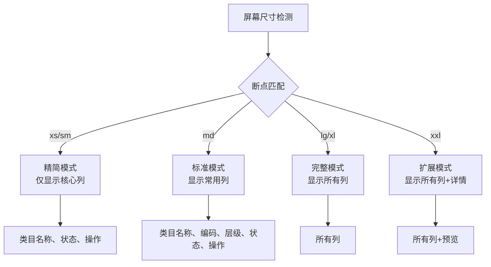
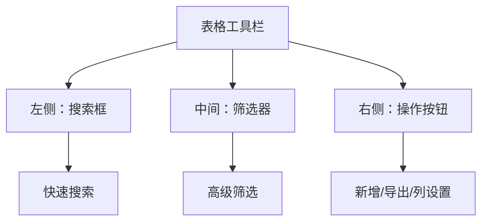

# 表格布局优化方案

## 一、当前表格布局问题分析

### 1.1 空间利用率问题

**问题描述：**
- 表格固定宽度 1186px，在小屏幕上会出现横向滚动条
- 13 列数据中，部分列（如类目ID、父类目ID）占用空间但信息密度低
- URL 类字段（类目图标URL、类目配图URL）占用大量空间但实际使用频率低
- 列宽分配不均，部分列过宽（180px、120px），部分列过窄（80px）

**影响：**
- 用户需要频繁横向滚动才能查看完整数据
- 重要信息（如类目名称、状态）可能被挤出可视区域
- 空间浪费导致信息密度降低

### 1.2 信息层级问题

**问题描述：**
- 所有列平铺展示，缺乏信息优先级区分
- 操作列与数据列混在一起，视觉权重不明确
- 状态信息（启用/禁用）没有视觉强调
- 层级关系（一级/二级/三级）仅通过数字表示，不够直观

**影响：**
- 用户难以快速定位关键信息
- 操作入口不够突出
- 数据关系不够清晰

### 1.3 响应式表现问题

**问题描述：**
- 表格宽度固定，无法自适应不同屏幕尺寸
- 在移动端或小屏幕上体验极差
- 没有针对不同设备的布局策略

**影响：**
- 跨设备体验不一致
- 移动端用户无法正常使用

### 1.4 交互体验问题

**问题描述：**
- 缺少数据加载状态提示
- 没有排序、筛选功能的视觉反馈
- 空状态（暂无数据）展示过于简单
- 缺少批量操作入口

**影响：**
- 用户不知道系统状态
- 操作反馈不足
- 空状态引导性差

---

## 二、优化策略

### 2.1 列宽自适应策略

#### 策略一：智能列宽分配



**实现方案：**

```javascript
const columnConfig = {
  // 固定宽度列
  fixed: {
    categoryId: { width: 80, priority: 'low' },
    categoryCode: { width: 100, priority: 'medium' },
    parentId: { width: 80, priority: 'low' },
    level: { width: 80, priority: 'medium' },
    sortOrder: { width: 80, priority: 'low' },
    isLeaf: { width: 80, priority: 'low' },
    status: { width: 80, priority: 'high' },
    actions: { width: 120, priority: 'high' }
  },
  // 弹性宽度列
  flexible: {
    categoryName: { minWidth: 120, maxWidth: 200, priority: 'high' },
    categoryPath: { minWidth: 120, maxWidth: 250, priority: 'medium' },
    iconUrl: { minWidth: 150, maxWidth: 300, priority: 'low' },
    imageUrl: { minWidth: 150, maxWidth: 300, priority: 'low' },
    createTime: { minWidth: 160, maxWidth: 200, priority: 'medium' }
  }
}
```

#### 策略二：列可见性控制

**优先级分层：**

| 优先级 | 列名 | 默认显示 | 可隐藏 |
|--------|------|----------|--------|
| 高 | 类目名称、状态、操作 | ✅ | ❌ |
| 中 | 类目编码、层级、类目路径、创建时间 | ✅ | ✅ |
| 低 | 类目ID、父类目ID、同级排序、是否叶子类目、URL列 | ❌ | ✅ |

**实现方案：**

```vue
<template>
  <el-table-column
    v-for="column in visibleColumns"
    :key="column.prop"
    :prop="column.prop"
    :label="column.label"
    :width="column.width"
    :min-width="column.minWidth"
    :fixed="column.fixed"
  />
</template>

<script>
export default {
  data() {
    return {
      columnVisibility: {
        categoryId: false,
        categoryCode: true,
        categoryName: true,
        parentId: false,
        level: true,
        categoryPath: true,
        iconUrl: false,
        imageUrl: false,
        sortOrder: false,
        isLeaf: false,
        status: true,
        createTime: true,
        actions: true
      }
    }
  },
  computed: {
    visibleColumns() {
      return this.allColumns.filter(col => 
        this.columnVisibility[col.prop]
      )
    }
  }
}
</script>
```

### 2.2 固定表头/首列策略

**固定策略：**



**实现方案：**

```vue
<el-table
  :data="tableData"
  height="600"
  border
  stripe
  highlight-current-row
>
  <!-- 固定首列 -->
  <el-table-column
    prop="categoryName"
    label="类目名称"
    fixed="left"
    width="150"
  />
  
  <!-- 其他列 -->
  <el-table-column
    v-for="column in otherColumns"
    :key="column.prop"
    :prop="column.prop"
    :label="column.label"
    :width="column.width"
  />
  
  <!-- 固定操作列 -->
  <el-table-column
    label="操作"
    fixed="right"
    width="120"
  >
    <template #default="{ row }">
      <el-button size="small" @click="handleEdit(row)">编辑</el-button>
      <el-button size="small" type="danger" @click="handleDelete(row)">删除</el-button>
    </template>
  </el-table-column>
</el-table>
```

### 2.3 内容换行策略

**换行规则：**

| 列类型 | 换行策略 | 最大行数 | 超出处理 |
|--------|----------|----------|----------|
| 短文本 | 不换行 | 1 | 省略号 + Tooltip |
| 中长文本 | 智能换行 | 2 | 省略号 + Tooltip |
| 长文本/URL | 换行 | 3 | 省略号 + 展开/收起 |
| 路径 | 换行 | 2 | 省略号 + Tooltip |

**实现方案：**

```vue
<el-table-column
  prop="categoryName"
  label="类目名称"
  :show-overflow-tooltip="true"
>
  <template #default="{ row }">
    <div class="cell-content">
      {{ row.categoryName }}
    </div>
  </template>
</el-table-column>

<style>
.cell-content {
  white-space: pre-wrap;
  word-break: break-word;
  line-height: 1.5;
  max-height: 3em;
  overflow: hidden;
  text-overflow: ellipsis;
}
</style>
```

### 2.4 分页/滚动控制策略

**混合策略：**



**实现方案：**

```vue
<template>
  <div class="table-container">
    <el-table
      v-loading="loading"
      :data="displayData"
      height="600"
      @scroll="handleScroll"
    >
      <!-- 列定义 -->
    </el-table>
    
    <!-- 分页组件 -->
    <el-pagination
      v-if="usePagination"
      v-model:current-page="currentPage"
      v-model:page-size="pageSize"
      :total="total"
      :page-sizes="[20, 50, 100]"
      layout="total, sizes, prev, pager, next, jumper"
      @size-change="handleSizeChange"
      @current-change="handleCurrentChange"
    />
  </div>
</template>

<script>
export default {
  data() {
    return {
      loading: false,
      tableData: [],
      currentPage: 1,
      pageSize: 20,
      total: 0,
      usePagination: true
    }
  },
  computed: {
    displayData() {
      if (this.usePagination) {
        const start = (this.currentPage - 1) * this.pageSize
        const end = start + this.pageSize
        return this.tableData.slice(start, end)
      }
      return this.tableData
    }
  },
  methods: {
    async loadData() {
      this.loading = true
      try {
        const res = await api.getCategories({
          page: this.currentPage,
          size: this.pageSize
        })
        this.tableData = res.data
        this.total = res.total
      } finally {
        this.loading = false
      }
    },
    handleScroll({ scrollTop, scrollHeight, clientHeight }) {
      // 虚拟滚动或无限滚动逻辑
      if (scrollTop + clientHeight >= scrollHeight - 100) {
        this.loadMore()
      }
    }
  }
}
</script>
```

---

## 三、响应式布局方案

### 3.1 断点定义

```javascript
const breakpoints = {
  xs: '< 576px',      // 手机竖屏
  sm: '576px - 768px', // 手机横屏/小平板
  md: '768px - 992px', // 平板
  lg: '992px - 1200px', // 小笔记本
  xl: '1200px - 1600px', // 桌面
  xxl: '> 1600px'      // 大屏
}
```

### 3.2 响应式列配置



**实现方案：**

```javascript
const responsiveColumns = {
  xs: ['categoryName', 'status', 'actions'],
  sm: ['categoryName', 'status', 'actions'],
  md: ['categoryName', 'categoryCode', 'level', 'status', 'actions'],
  lg: ['categoryName', 'categoryCode', 'level', 'categoryPath', 'status', 'createTime', 'actions'],
  xl: ['categoryName', 'categoryCode', 'parentId', 'level', 'categoryPath', 'status', 'createTime', 'actions'],
  xxl: 'all'
}

export default {
  computed: {
    currentBreakpoint() {
      const width = window.innerWidth
      if (width < 576) return 'xs'
      if (width < 768) return 'sm'
      if (width < 992) return 'md'
      if (width < 1200) return 'lg'
      if (width < 1600) return 'xl'
      return 'xxl'
    },
    visibleColumns() {
      const columns = responsiveColumns[this.currentBreakpoint]
      if (columns === 'all') return this.allColumns
      return this.allColumns.filter(col => columns.includes(col.prop))
    }
  }
}
```

### 3.3 移动端卡片式布局

**小屏幕下切换为卡片视图：**

```vue
<template>
  <div class="responsive-table">
    <!-- 桌面端：表格视图 -->
    <el-table
      v-if="!isMobile"
      :data="tableData"
      :columns="visibleColumns"
    />
    
    <!-- 移动端：卡片视图 -->
    <div v-else class="card-list">
      <div
        v-for="item in tableData"
        :key="item.id"
        class="card-item"
        @click="showDetail(item)"
      >
        <div class="card-header">
          <span class="card-title">{{ item.categoryName }}</span>
          <el-tag :type="item.status === 1 ? 'success' : 'danger'">
            {{ item.status === 1 ? '启用' : '禁用' }}
          </el-tag>
        </div>
        <div class="card-body">
          <div class="card-row">
            <span class="label">编码：</span>
            <span class="value">{{ item.categoryCode }}</span>
          </div>
          <div class="card-row">
            <span class="label">层级：</span>
            <span class="value">{{ item.level }}级</span>
          </div>
        </div>
        <div class="card-footer">
          <el-button size="small" @click.stop="handleEdit(item)">编辑</el-button>
          <el-button size="small" type="danger" @click.stop="handleDelete(item)">删除</el-button>
        </div>
      </div>
    </div>
  </div>
</template>

<style scoped>
.card-list {
  display: flex;
  flex-direction: column;
  gap: 12px;
}

.card-item {
  background: #fff;
  border-radius: 8px;
  padding: 16px;
  box-shadow: 0 2px 8px rgba(0, 0, 0, 0.1);
  cursor: pointer;
  transition: transform 0.2s, box-shadow 0.2s;
}

.card-item:active {
  transform: scale(0.98);
}

.card-header {
  display: flex;
  justify-content: space-between;
  align-items: center;
  margin-bottom: 12px;
}

.card-title {
  font-size: 16px;
  font-weight: 600;
  color: #303133;
}

.card-body {
  display: flex;
  flex-direction: column;
  gap: 8px;
  margin-bottom: 12px;
}

.card-row {
  display: flex;
  font-size: 14px;
}

.card-row .label {
  color: #909399;
  min-width: 60px;
}

.card-row .value {
  color: #606266;
  flex: 1;
}

.card-footer {
  display: flex;
  gap: 812px;
  justify-content: flex-end;
}
</style>
```

---

## 四、交互体验优化建议

### 4.1 排序/筛选控件位置调整

**优化前：**
- 排序图标在列标题内，不够明显
- 筛选条件分散在表格上方

**优化后：**



**实现方案：**

```vue
<template>
  <div class="table-toolbar">
    <!-- 左侧：搜索 -->
    <div class="toolbar-left">
      <el-input
        v-model="searchKeyword"
        placeholder="搜索类目名称或编码"
        prefix-icon="Search"
        clearable
        @input="handleSearch"
      />
    </div>
    
    <!-- 中间：筛选器 -->
    <div class="toolbar-center">
      <el-select
        v-model="filterLevel"
        placeholder="筛选层级"
        clearable
        @change="handleFilter"
      >
        <el-option label="一级类目" :value="1" />
        <el-option label="二级类目" :value="2" />
        <el-option label="三级类目" :value="3" />
      </el-select>
      
      <el-select
        v-model="filterStatus"
        placeholder="筛选状态"
        clearable
        @change="handleFilter"
      >
        <el-option label="启用" :value="1" />
        <el-option label="禁用" :value="0" />
      </el-select>
    </div>
    
    <!-- 右侧：操作按钮 -->
    <div class="toolbar-right">
      <el-button type="primary" @click="handleAdd">
        <el-icon><Plus /></el-icon>
        新增类目
      </el-button>
      
      <el-dropdown @command="handleCommand">
        <el-button>
          更多操作
          <el-icon class="el-icon--right"><ArrowDown /></el-icon>
        </el-button>
        <template #dropdown>
          <el-dropdown-menu>
            <el-dropdown-item command="export">导出数据</el-dropdown-item>
            <el-dropdown-item command="column">列设置</el-dropdown-item>
            <el-dropdown-item command="refresh">刷新</el-dropdown-item>
          </el-dropdown-menu>
        </template>
      </el-dropdown>
    </div>
  </div>
</template>

<style scoped>
.table-toolbar {
  display: flex;
  align-items: center;
  gap: 16px;
  padding: 16px;
  background: #f5f7fa;
  border-radius: 4px;
  margin-bottom: 16px;
}

.toolbar-left {
  flex: 1;
  min-width: 200px;
}

.toolbar-center {
  display: flex;
  gap: 12px;
}

.toolbar-right {
  display: flex;
  gap: 8px;
}
</style>
```

### 4.2 数据加载状态提示

**加载状态设计：**

```vue
<template>
  <el-table
    v-loading="loading"
    element-loading-text="数据加载中..."
    element-loading-spinner="el-icon-loading"
    element-loading-background="rgba(0, 0, 0, 0.1)"
    :data="tableData"
  >
    <!-- 列定义 -->
    
    <!-- 空状态 -->
    <template #empty>
      <div class="empty-state">
        <el-empty
          :image="emptyImage"
          :description="emptyDescription"
        >
          <el-button type="primary" @click="handleAdd">
            创建第一个类目
          </el-button>
        </el-empty>
      </div>
    </template>
  </el-table>
</template>

<script>
export default {
  computed: {
    emptyImage() {
      if (this.hasFilter) {
        return 'https://element-plus.org/images/empty.png'
      }
      return 'https://element-plus.org/images/empty-data.png'
    },
    emptyDescription() {
      if (this.hasFilter) {
        return '没有找到匹配的数据'
      }
      return '暂无类目数据'
    },
    hasFilter() {
      return this.searchKeyword || this.filterLevel || this.filterStatus
    }
  }
}
</script>
```

### 4.3 批量操作优化

**批量操作栏：**

```vue
<template>
  <div class="batch-actions" v-if="selectedRows.length > 0">
    <div class="selection-info">
      已选择 <span class="count">{{ selectedRows.length }}</span> 项
    </div>
    <div class="action-buttons">
      <el-button size="small" @click="handleBatchEnable">批量启用</el-button>
      <el-button size="small" @click="handleBatchDisable">批量禁用</el-button>
      <el-button size="small" type="danger" @click="handleBatchDelete">批量删除</el-button>
      <el-button size="small" @click="clearSelection">取消选择</el-button>
    </div>
  </div>
</template>

<style scoped>
.batch-actions {
  position: sticky;
  top: 0;
  z-index: 10;
  display: flex;
  justify-content: space-between;
  align-items: center;
  padding: 12px 16px;
  background: #e6f7ff;
  border: 1px solid #91d5ff;
  border-radius: 4px;
  margin-bottom: 16px;
  animation: slideDown 0.3s ease;
}

@keyframes slideDown {
  from {
    opacity: 0;
    transform: translateY(-20px);
  }
  to {
    opacity: 1;
    transform: translateY(0);
  }
}

.selection-info .count {
  font-size: 18px;
  font-weight: 600;
  color: #1890ff;
}
</style>
```

### 4.4 行展开详情

**详情展开功能：**

```vue
<template>
  <el-table
    :data="tableData"
    @expand-change="handleExpand"
  >
    <el-table-column type="expand">
      <template #default="{ row }">
        <div class="expand-content">
          <el-descriptions :column="3" border>
            <el-descriptions-item label="类目ID">
              {{ row.categoryId }}
            </el-descriptions-item>
            <el-descriptions-item label="类目编码">
              {{ row.categoryCode }}
            </el-descriptions-item>
            <el-descriptions-item label="父类目ID">
              {{ row.parentId }}
            </el-descriptions-item>
            <el-descriptions-item label="类目路径">
              {{ row.categoryPath }}
            </el-descriptions-item>
            <el-descriptions-item label="同级排序">
              {{ row.sortOrder }}
            </el-descriptions-item>
            <el-descriptions-item label="是否叶子类目">
              {{ row.isLeaf === 1 ? '是' : '否' }}
            </el-descriptions-item>
            <el-descriptions-item label="类目图标" :span="3">
              <el-image
                v-if="row.iconUrl"
                :src="row.iconUrl"
                :preview-src-list="[row.iconUrl]"
                style="width: 60px; height: 60px"
              />
              <span v-else>未设置</span>
            </el-descriptions-item>
            <el-descriptions-item label="类目配图" :span="3">
              <el-image
                v-if="row.imageUrl"
                :src="row.imageUrl"
                :preview-src-list="[row.imageUrl]"
                style="width: 100px; height: 100px"
              />
              <span v-else>未设置</span>
            </el-descriptions-item>
          </el-descriptions>
        </div>
      </template>
    </el-table-column>
    
    <!-- 其他列 -->
  </el-table>
</template>
```

---

## 五、视觉设计规范

### 5.1 单元格间距规范

```css
/* 表格整体间距 */
.el-table {
  --cell-padding-vertical: 12px;
  --cell-padding-horizontal: 16px;
}

/* 表头单元格 */
.el-table th.el-table__cell {
  padding: var(--cell-padding-vertical) var(--cell-padding-horizontal);
}

/* 表体单元格 */
.el-table td.el-table__cell {
  padding: var(--cell-padding-vertical) var(--cell-padding-horizontal);
}

/* 紧凑模式 */
.el-table--compact {
  --cell-padding-vertical: 8px;
  --cell-padding-horizontal: 12px;
}

/* 宽松模式 */
.el-table--spacious {
  --cell-padding-vertical: 16px;
  --cell-padding-horizontal: 20px;
}
```

### 5.2 字体大小规范

```css
/* 字体大小变量 */
:root {
  --table-font-size-base: 14px;
  --table-font-size-small: 12px;
  --table-font-size-large: 16px;
  
  --table-font-weight-normal: 400;
  --table-font-weight-medium: 500;
  --table-font-weight-bold: 600;
}

/* 表头字体 */
.el-table th.el-table__cell {
  font-size: var(--table-font-size-base);
  font-weight: var(--table-font-weight-medium);
}

/* 表体字体 */
.el-table td.el-table__cell {
  font-size: var(--table-font-size-base);
  font-weight: var(--table-font-weight-normal);
}

/* 数字列字体 */
.el-table .cell-number {
  font-family: 'SF Mono', 'Monaco', 'Consolas', monospace;
  font-variant-numeric: tabular-nums;
}
```

### 5.3 行高规范

```css
/* 行高变量 */
:root {
  --table-line-height-base: 1.5;
  --table-line-height-compact: 1.3;
  --table-line-height-spacious: 1.8;
}

/* 表格行高 */
.el-table .el-table__row {
  height: auto;
}

.el-table .cell {
  line-height: var(--table-line-height-base);
}

/* 多行内容 */
.el-table .cell-multiline {
  line-height: var(--table-line-height-base);
  min-height: calc(var(--table-font-size-base) * var(--table-line-height-base) * 2);
}
```

### 5.4 强调色使用规范

```css
/* 主题色变量 */
:root {
  /* 主色调 */
  --table-color-primary: #409eff;
  --table-color-success: #67c23a;
  --table-color-warning: #e6a23c;
  --table-color-danger: #f56c6c;
  --table-color-info: #909399;
  
  /* 文字颜色 */
  --table-color-text-primary: #303133;
  --table-color-text-regular: #606266;
  --table-color-text-secondary: #909399;
  --table-color-text-placeholder: #c0c4cc;
  
  /* 背景色 */
  --table-color-bg-header: #f5f7fa;
  --table-color-bg-row-hover: #f5f7fa;
  --table-color-bg-row-striped: #fafafa;
  --table-color-bg-selected: #ecf5ff;
  
  /* 边框色 */
  --table-color-border: #ebeef5;
  --table-color-border-light: #dcdfe6;
}

/* 状态标签样式 */
.status-tag {
  display: inline-flex;
  align-items: center;
  padding: 4px 812px;
  border-radius: 4px;
  font-size: 12px;
  font-weight: 500;
}

.status-tag--enabled {
  background: #f0f9ff;
  color: var(--table-color-success);
  border: 1px solid #b3e19d;
}

.status-tag--disabled {
  background: #fef0f0;
  color: var(--table-color-danger);
  border: 1px solid #fbc4c4;
}

/* 层级标识样式 */
.level-badge {
  display: inline-flex;
  align-items: center;
  justify-content: center;
  width: 24px;
  height: 24px;
  border-radius: 50%;
  font-size: 12px;
  font-weight: 600;
}

.level-badge--1 {
  background: #e6f7ff;
  color: #1890ff;
}

.level-badge--2 {
  background: #fff7e6;
  color: #fa8c16;
}

.level-badge--3 {
  background: #f6ffed;
  color: #52c41a;
}
```

### 5.5 完整样式示例

```vue
<template>
  <el-table
    :data="tableData"
    class="custom-table"
    :row-class-name="getRowClassName"
    :cell-class-name="getCellClassName"
  >
    <el-table-column prop="categoryName" label="类目名称">
      <template #default="{ row }">
        <div class="cell-content">
          <span class="level-badge" :class="`level-badge--${row.level}`">
            {{ row.level }}
          </span>
          <span class="category-name">{{ row.categoryName }}</span>
        </div>
      </template>
    </el-table-column>
    
    <el-table-column prop="status" label="状态" width="80">
      <template #default="{ row }">
        <span class="status-tag" :class="row.status === 1 ? 'status-tag--enabled' : 'status-tag--disabled'">
          {{ row.status === 1 ? '启用' : '禁用' }}
        </span>
      </template>
    </el-table-column>
  </el-table>
</template>

<style scoped>
.custom-table {
  --table-color-primary: #409eff;
  --table-color-success: #67c23a;
  --table-color-danger: #f56c6c;
  --cell-padding-vertical: 12px;
  --cell-padding-horizontal: 16px;
}

.custom-table th.el-table__cell {
  background: var(--table-color-bg-header);
  font-weight: 500;
  color: var(--table-color-text-primary);
}

.custom-table td.el-table__cell {
  padding: var(--cell-padding-vertical) var(--cell-padding-horizontal);
}

.cell-content {
  display: flex;
  align-items: center;
  gap: 812px;
}

.level-badge {
  display: inline-flex;
  align-items: center;
  justify-content: center;
  width: 24px;
  height: 24px;
  border-radius: 50%;
  font-size: 12px;
  font-weight: 600;
}

.level-badge--1 {
  background: #e6f7ff;
  color: #1890ff;
}

.level-badge--2 {
  background: #fff7e6;
  color: #fa8c16;
}

.level-badge--3 {
  background: #f6ffed;
  color: #52c41a;
}

.category-name {
  font-weight: 500;
}

.status-tag {
  display: inline-flex;
  align-items: center;
  padding: 4px 812px;
  border-radius: 4px;
  font-size: 12px;
  font-weight: 500;
}

.status-tag--enabled {
  background: #f0f9ff;
  color: var(--table-color-success);
  border: 1px solid #b3e19d;
}

.status-tag--disabled {
  background: #fef0f0;
  color: var(--table-color-danger);
  border: 1px solid #fbc4c4;
}
</style>
```

---

## 六、动效说明

### 6.1 加载动画

**骨架屏加载：**

```vue
<template>
  <el-table v-if="loading" class="skeleton-table">
    <el-table-column
      v-for="column in columns"
      :key="column.prop"
      :label="column.label"
      :width="column.width"
    >
      <template #default>
        <div class="skeleton-cell">
          <div class="skeleton-shimmer"></div>
        </div>
      </template>
    </el-table-column>
  </el-table>
  
  <el-table v-else :data="tableData">
    <!-- 实际数据 -->
  </el-table>
</template>

<style scoped>
.skeleton-cell {
  height: 20px;
  position: relative;
  overflow: hidden;
}

.skeleton-shimmer {
  position: absolute;
  top: 0;
  left: 0;
  width: 100%;
  height: 100%;
  background: linear-gradient(
    90deg,
    #f2f2f2 25%,
    #e6e6e6 50%,
    #f2f2f2 75%
  );
  background-size: 200% 100%;
  animation: shimmer 1.5s infinite;
}

@keyframes shimmer {
  0% {
    background-position: 200% 0;
  }
  100% {
    background-position: -200% 0;
  }
}
</style>
```

### 6.2 行进入动画

```css
/* 行进入动画 */
.el-table .el-table__row {
  animation: rowEnter 0.3s ease-out;
}

@keyframes rowEnter {
  from {
    opacity: 0;
    transform: translateY(10px);
  }
  to {
    opacity: 1;
    transform: translateY(0);
  }
}

/* 交错延迟 */
.el-table .el-table__row:nth-child(1) { animation-delay: 0.05s; }
.el-table .el-table__row:nth-child(2) { animation-delay: 0.1s; }
.el-table .el-table__row:nth-child(3) { animation-delay: 0.15s; }
.el-table .el-table__row:nth-child(4) { animation-delay: 0.2s; }
.el-table .el-table__row:nth-child(5) { animation-delay: 0.25s; }
```

### 6.3 排序动画

```css
/* 排序指示器动画 */
.sort-icon {
  transition: transform 0.3s ease;
}

.sort-icon--asc {
  transform: rotate(180deg);
}

.sort-icon--desc {
  transform: rotate(0deg);
}

/* 排序时行重新排序动画 */
.el-table .el-table__row {
  transition: all 0.3s ease;
}

.el-table .el-table__row.sorting {
  opacity: 0.5;
  transform: scale(0.98);
}
```

### 6.4 展开动画

```css
/* 展开内容动画 */
.el-table__expanded-row {
  animation: expandOpen 0.3s ease-out;
}

@keyframes expandOpen {
  from {
    opacity: 0;
    max-height: 0;
  }
  to {
    opacity: 1;
    max-height: 500px;
  }
}

/* 展开图标旋转 */
.expand-icon {
  transition: transform 0.3s ease;
}

.expand-icon--expanded {
  transform: rotate(90deg);
}
```

### 6.5 悬停效果

```css
/* 行悬停效果 */
.el-table .el-table__row:hover {
  background: var(--table-color-bg-row-hover);
  transition: background 0.2s ease;
}

/* 单元格悬停效果 */
.el-table .el-table__cell:hover {
  background: rgba(64, 158, 255, 0.05);
}

/* 操作按钮悬停效果 */
.action-button {
  transition: all 0.2s ease;
}

.action-button:hover {
  transform: translateY(-2px);
  box-shadow: 0 4px 812px rgba(0, 0, 0, 0.12);
}
```

---

## 七、实现难点分析

### 7.1 列宽自适应计算

**难点：**
- 需要同时考虑固定列和弹性列
- 内容长度不确定，需要动态计算
- 性能问题：频繁计算会影响性能

**解决方案：**

```javascript
class TableLayoutCalculator {
  constructor(containerWidth, columns) {
    this.containerWidth = containerWidth
    this.columns = columns
  }
  
  calculate() {
    // 1. 计算固定列总宽度
    const fixedWidth = this.columns
      .filter(col => col.fixed)
      .reduce((sum, col) => sum + col.width, 0)
    
    // 2. 计算剩余可用空间
    const remainingWidth = this.containerWidth - fixedWidth
    
    // 3. 计算弹性列的权重总和
    const totalWeight = this.columns
      .filter(col => !col.fixed)
      .reduce((sum, col) => sum + (col.weight || 1), 0)
    
    // 4. 按权重分配剩余空间
    const flexibleColumns = this.columns.filter(col => !col.fixed)
    flexibleColumns.forEach(col => {
      const weight = col.weight || 1
      const allocatedWidth = (remainingWidth * weight) / totalWeight
      
      // 应用最小/最大宽度限制
      col.calculatedWidth = Math.max(
        col.minWidth || 80,
        Math.min(col.maxWidth || 300, allocatedWidth)
      )
    })
    
    return this.columns
  }
}

// 使用防抖优化性能
const debouncedCalculate = debounce(() => {
  const calculator = new TableLayoutCalculator(
    tableContainer.value.offsetWidth,
    columns.value
  )
  columns.value = calculator.calculate()
}, 300)

window.addEventListener('resize', debouncedCalculate)
```

### 7.2 虚拟滚动实现

**难点：**
- 需要精确计算滚动位置
- 动态高度处理复杂
- 滚动性能优化

**解决方案：**

```vue
<template>
  <div class="virtual-table" @scroll="handleScroll">
    <div class="virtual-spacer" :style="{ height: totalHeight + 'px' }"></div>
    <div
      class="virtual-content"
      :style="{ transform: `translateY(${offsetY}px)` }"
    >
      <div
        v-for="item in visibleItems"
        :key="item.id"
        class="virtual-row"
        :style="{ height: getRowHeight(item) + 'px' }"
      >
        <!-- 行内容 -->
      </div>
    </div>
  </div>
</template>

<script>
export default {
  data() {
    return {
      allItems: [],
      visibleItems: [],
      rowHeight: 50,
      bufferSize: 5,
      scrollTop: 0
    }
  },
  computed: {
    totalHeight() {
      return this.allItems.length * this.rowHeight
    },
    visibleCount() {
      return Math.ceil(this.containerHeight / this.rowHeight)
    },
    startIndex() {
      return Math.max(
        0,
        Math.floor(this.scrollTop / this.rowHeight) - this.bufferSize
      )
    },
    endIndex() {
      return Math.min(
        this.allItems.length,
        this.startIndex + this.visibleCount + this.bufferSize * 2
      )
    },
    offsetY() {
      return this.startIndex * this.rowHeight
    }
  },
  methods: {
    handleScroll(e) {
      this.scrollTop = e.target.scrollTop
      this.updateVisibleItems()
    },
    updateVisibleItems() {
      this.visibleItems = this.allItems.slice(
        this.startIndex,
        this.endIndex
      )
    },
    getRowHeight(item) {
      // 支持动态行高
      return this.rowHeights[item.id] || this.rowHeight
    }
  }
}
</script>
```

### 7.3 响应式断点监听

**难点：**
- 需要同时监听窗口大小变化
- 防抖处理避免频繁触发
- 需要考虑设备像素比

**解决方案：**

```javascript
class ResponsiveBreakpoint {
  constructor() {
    this.breakpoints = {
      xs: 576,
      sm: 768,
      md: 992,
      lg: 1200,
      xl: 1600
    }
    this.current = this.getCurrent()
    this.listeners = []
    
    this.init()
  }
  
  init() {
    window.addEventListener('resize', this.handleResize.bind(this))
  }
  
  getCurrent() {
    const width = window.innerWidth
    const dpr = window.devicePixelRatio || 1
    
    // 考虑设备像素比
    const adjustedWidth = width * dpr
    
    if (adjustedWidth < this.breakpoints.xs) return 'xs'
    if (adjustedWidth < this.breakpoints.sm) return 'sm'
    if (adjustedWidth < this.breakpoints.md) return 'md'
    if (adjustedWidth < this.breakpoints.lg) return 'lg'
    if (adjustedWidth < this.breakpoints.xl) return 'xl'
    return 'xxl'
  }
  
  handleResize() {
    const newBreakpoint = this.getCurrent()
    
    if (newBreakpoint !== this.current) {
      const oldBreakpoint = this.current
      this.current = newBreakpoint
      
      this.notifyListeners(oldBreakpoint, newBreakpoint)
    }
  }
  
  onBreakpointChange(callback) {
    this.listeners.push(callback)
  }
  
  notifyListeners(oldBreakpoint, newBreakpoint) {
    this.listeners.forEach(callback => {
      callback(oldBreakpoint, newBreakpoint)
    })
  }
  
  destroy() {
    window.removeEventListener('resize', this.handleResize.bind(this))
  }
}

// 使用示例
const breakpoint = new ResponsiveBreakpoint()

breakpoint.onBreakpointChange((old, current) => {
  console.log(`断点从 ${old} 变为 ${current}`)
  updateTableLayout(current)
})
```

### 7.4 性能优化

**难点：**
- 大数据量渲染性能
- 频繁更新导致的重绘
- 内存占用问题

**解决方案：**

```javascript
// 1. 使用虚拟滚动
// 2. 数据分片加载
class DataLoader {
  constructor(chunkSize = 100) {
    this.chunkSize = chunkSize
    this.loadedChunks = new Set()
  }
  
  async loadChunk(chunkIndex) {
    if (this.loadedChunks.has(chunkIndex)) {
      return
    }
    
    const data = await api.fetchData({
      offset: chunkIndex * this.chunkSize,
      limit: this.chunkSize
    })
    
    this.loadedChunks.add(chunkIndex)
    return data
  }
}

// 3. 使用 Object.freeze 防止不必要的响应式追踪
function optimizeData(data) {
  return data.map(item => Object.freeze({
    ...item,
    // 冻结嵌套对象
    nested: Object.freeze(item.nested)
  }))
}

// 4. 使用 requestAnimationFrame 优化动画
function animateUpdate(callback) {
  let rafId = null
  
  return function(...args) {
    if (rafId) {
      cancelAnimationFrame(rafId)
    }
    
    rafId = requestAnimationFrame(() => {
      callback(...args)
      rafId = null
    })
  }
}

// 5. 使用 Web Worker 处理大数据
const worker = new Worker('data-processor.js')

worker.postMessage({
  type: 'process',
  data: largeDataSet
})

worker.onmessage = (e) => {
  const processedData = e.data
  updateTable(processedData)
}
```

---

## 八、兼容性考虑

### 8.1 浏览器兼容性

| 特性 | Chrome | Firefox | Safari | Edge | IE11 |
|------|--------|---------|--------|------|------|
| CSS Grid | ✅ 57+ | ✅ 52+ | ✅ 10.1+ | ✅ 16+ | ❌ |
| CSS Flexbox | ✅ 29+ | ✅ 28+ | ✅ 9+ | ✅ 12+ | ⚠️ 10+ |
| CSS Variables | ✅ 49+ | ✅ 31+ | ✅ 9.1+ | ✅ 15+ | ❌ |
| Intersection Observer | ✅ 51+ | ✅ 55+ | ✅ 12.1+ | ✅ 15+ | ❌ |
| Resize Observer | ✅ 64+ | ✅ 69+ | ✅ 13.1+ | ✅ 79+ | ❌ |

**兼容性处理：**

```javascript
// 检测特性支持
const supports = {
  grid: CSS.supports('display', 'grid'),
  flexbox: CSS.supports('display', 'flex'),
  variables: CSS.supports('--test', '0'),
  intersectionObserver: 'IntersectionObserver' in window,
  resizeObserver: 'ResizeObserver' in window
}

// 降级方案
if (!supports.resizeObserver) {
  // 使用轮询作为降级方案
  class ResizeObserverPolyfill {
    constructor(callback) {
      this.callback = callback
      this.elements = new Set()
      this.interval = null
    }
    
    observe(element) {
      this.elements.add(element)
      this.startPolling()
    }
    
    unobserve(element) {
      this.elements.delete(element)
      if (this.elements.size === 0) {
        this.stopPolling()
      }
    }
    
    startPolling() {
      if (this.interval) return
      
      this.interval = setInterval(() => {
        this.elements.forEach(element => {
          const rect = element.getBoundingClientRect()
          this.callback([{
            target: element,
            contentRect: rect
          }])
        })
      }, 100)
    }
    
    stopPolling() {
      if (this.interval) {
        clearInterval(this.interval)
        this.interval = null
      }
    }
  }
  
  window.ResizeObserver = ResizeObserverPolyfill
}
```

### 8.2 移动端兼容性

**触摸事件处理：**

```javascript
// 检测触摸设备
const isTouchDevice = 'ontouchstart' in window

// 统一事件处理
const events = {
  start: isTouchDevice ? 'touchstart' : 'mousedown',
  move: isTouchDevice ? 'touchmove' : 'mousemove',
  end: isTouchDevice ? 'touchend' : 'mouseup'
}

// 防止滚动冲突
function handleTouchMove(e) {
  const target = e.target
  
  // 如果在可滚动区域内，允许滚动
  if (target.closest('.scrollable')) {
    return
  }
  
  // 否则阻止默认行为
  e.preventDefault()
}

// 视口单位兼容
function getViewportHeight() {
  // 移动端浏览器地址栏问题
  const vh = window.innerHeight * 0.01
  document.documentElement.style.setProperty('--vh', `${vh}px`)
}

window.addEventListener('resize', getViewportHeight)
getViewportHeight()
```

### 8.3 性能降级方案

```javascript
// 检测设备性能
const isLowEndDevice = () => {
  const hardwareConcurrency = navigator.hardwareConcurrency || 2
  const deviceMemory = navigator.deviceMemory || 2
  
  return hardwareConcurrency <= 2 || deviceMemory <= 2
}

// 根据设备性能调整配置
const config = {
  virtualScroll: !isLowEndDevice(),
  animationDuration: isLowEndDevice() ? 0 : 300,
  debounceDelay: isLowEndDevice() ? 500 : 300,
  chunkSize: isLowEndDevice() ? 50 : 100
}

// 禁用动画
if (isLowEndDevice()) {
  document.documentElement.classList.add('no-animation')
}

/* CSS */
.no-animation * {
  animation: none !important;
  transition: none !important;
}
```

---