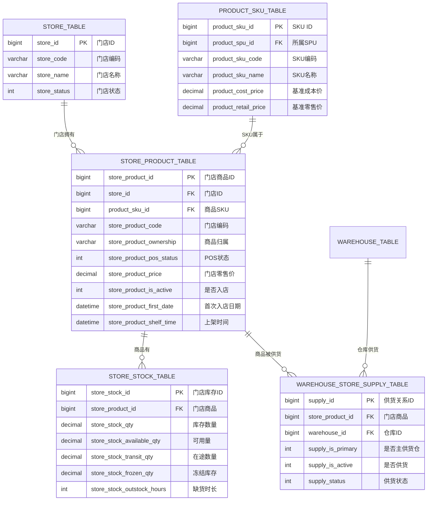
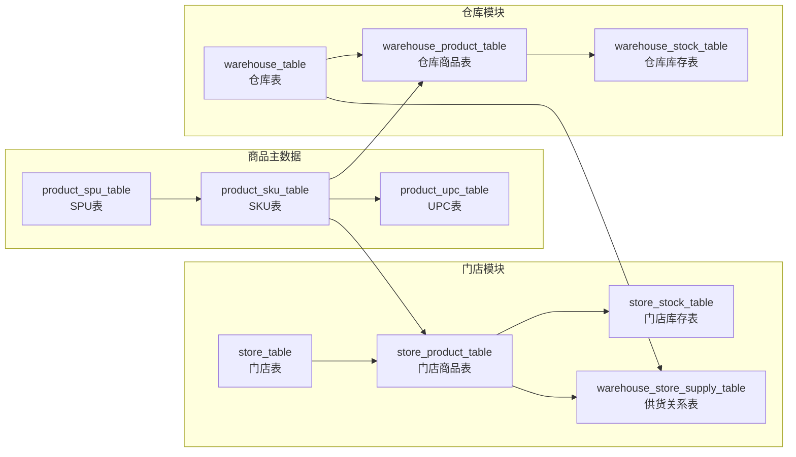
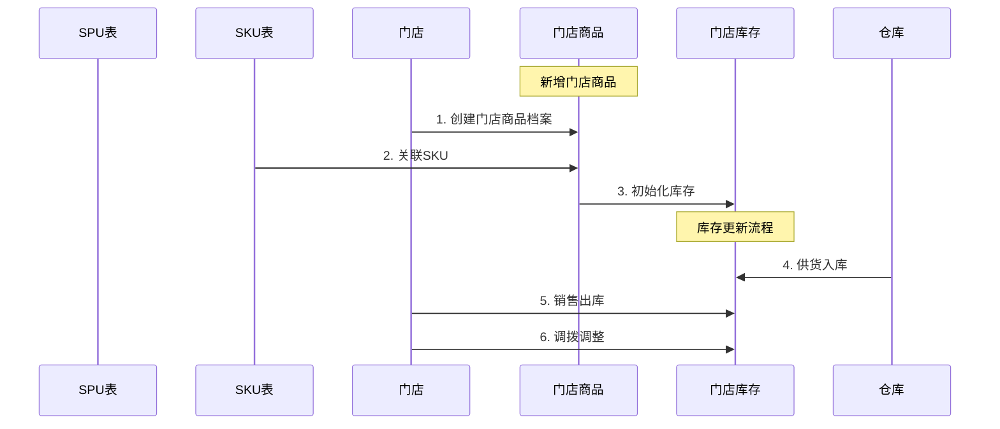

# 门店商品表数据库设计报告

## 一、表关系概览



---

## 二、核心表结构

### 2.1 门店商品表 (store_product_table)

| 字段名 | 类型 | 说明 |
|--------|------|------|
| `store_product_id` | bigint | 门店商品ID（主键） |
| `store_id` | bigint | 门店ID（外键→门店表） |
| `product_sku_id` | bigint | 商品SKU（外键→SKU表） |
| `store_product_code` | varchar | 门店商品编码 |
| `store_product_ownership` | varchar | 商品归属（自营/联营/加盟） |
| `store_product_pos_status` | int | POS状态（0未上架/1已上架） |
| `store_product_price` | decimal | 门店零售价 |
| `store_product_is_active` | int | 是否入店（0否/1是） |
| `store_product_first_date` | datetime | 首次入店日期 |
| `store_product_shelf_time` | datetime | 上架时间 |

### 2.2 门店库存表 (store_stock_table)

| 字段名 | 类型 | 说明 |
|--------|------|------|
| `store_stock_id` | bigint | 门店库存ID（主键） |
| `store_product_id` | bigint | 门店商品ID（外键） |
| `store_stock_qty` | decimal | 库存数量 |
| `store_stock_available_qty` | decimal | 可用数量 |
| `store_stock_transit_qty` | decimal | 在途数量 |
| `store_stock_frozen_qty` | decimal | 冻结库存 |
| `store_stock_outstock_hours` | int | 缺货时长（小时） |

### 2.3 仓库门店供货表 (warehouse_store_supply_table)

| 字段名 | 类型 | 说明 |
|--------|------|------|
| `supply_id` | bigint | 供货关系ID（主键） |
| `store_product_id` | bigint | 门店商品ID（外键） |
| `warehouse_id` | bigint | 仓库ID（外键→仓库表） |
| `supply_is_primary` | int | 是否主供货仓（0否/1是） |
| `supply_is_active` | int | 是否供货（0否/1是） |
| `supply_status` | int | 供货状态 |

---

## 三、表关联关系图



---

## 四、查询示例

### 4.1 查询某门店的所有商品及库存

```sql
SELECT
    s.store_name,
    sp.store_product_code,
    sku.product_sku_name,
    sku.product_sku_code,
    sp.store_product_price,
    ss.store_stock_qty,
    ss.store_stock_available_qty
FROM store_product_table sp
JOIN store_table s ON sp.store_id = s.store_id
JOIN product_sku_table sku ON sp.product_sku_id = sku.product_sku_id
LEFT JOIN store_stock_table ss ON sp.store_product_id = ss.store_product_id
WHERE s.store_id = 1;
```

### 4.2 查询某商品的门店分布

```sql
SELECT
    sku.product_sku_name,
    s.store_name,
    sp.store_product_code,
    sp.store_product_price,
    ss.store_stock_qty,
    w.supply_is_primary
FROM store_product_table sp
JOIN product_sku_table sku ON sp.product_sku_id = sku.product_sku_id
JOIN store_table s ON sp.store_id = s.store_id
LEFT JOIN store_stock_table ss ON sp.store_product_id = ss.store_product_id
LEFT JOIN warehouse_store_supply_table w ON sp.store_product_id = w.store_product_id
WHERE sku.product_sku_id = 1001;
```

---

## 五、业务流程图



---

## 六、总结

| 维度 | 说明 |
|------|------|
| **核心实体** | 门店商品 = 门店 + SKU + 价格策略 |
| **库存实体** | 门店库存 = 可用 + 在途 + 冻结 |
| **供货关系** | 多仓库对一个门店商品供货，区分主供货仓 |
| **商品流转** | SPU → SKU → 门店商品 → 门店库存 |
